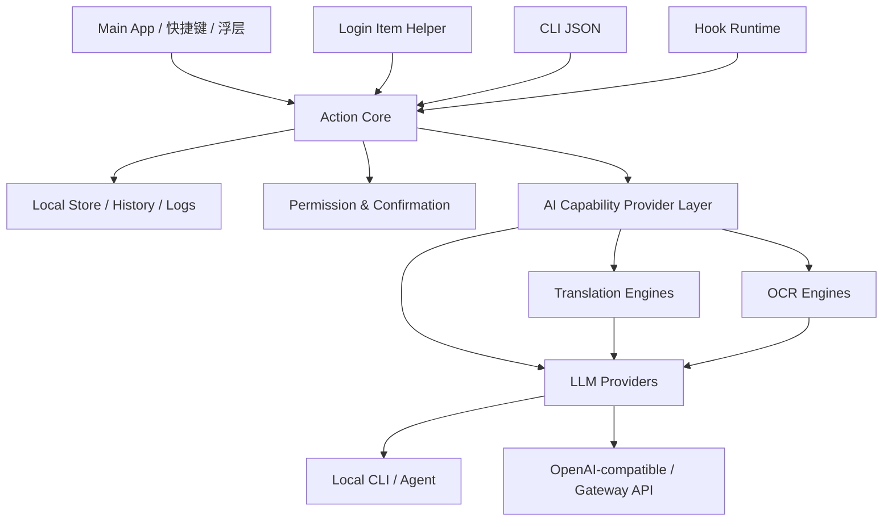

# AI / Agent / CLI / Hook 能力边界

状态：proposed
最后审阅：2026-07-02
来源级别：architecture hypothesis

本文定义截图、剪贴板、翻译三类工具叠加 AI、agent、CLI 和 hook 能力时的技术边界。P2-L 已固定 P3 前 scaffold 的首轮职责边界；具体实现仍需在正式工程中验证。

## 核心原则

- 工具本体优先：截图、剪贴板、翻译必须先是成熟好用的 Mac 工具。
- Action core 统一：UI、CLI、agent、hook 都调用同一组 action。
- Provider 可替换：LLM 可以来自本地 CLI，也可以来自 API；工具层不绑定单一模型。
- 用户确认优先：截图、剪贴板和翻译内容进入外部模型前必须可见、可取消、可审计。
- Hook 受控：hook 是自动化扩展点，不是默认开放的任意脚本执行入口。

## 分层模型



P2-L 进一步固定首轮进程边界：主 App 负责 UI、设置、权限、确认、Keychain 和审计展示；helper 优先负责剪贴板 recorder、后台心跳和轻量事件采集；helper 默认不执行外部 CLI provider 或 hook。

## AI Capability Provider Layer

P5-H 将 provider 口径从“翻译 provider”上移为全局能力层：LLM provider 服务所有 AI action，Translation Engine 和 OCR Engine 是独立能力域，可以复用 LLM，也可以接专用 API 或本地能力。P5-I 在此基础上新增 LLM adapter protocol、OpenAI-compatible profile boundary 和本地 mock adapter；P5-K 进一步新增 API key 输入预览、用户 Keychain 保存门禁和 OpenAI connection dry-run；P5-L 新增低敏 OpenAI-compatible test connection；P5-M 新增 provider route / error / localization foundation；P5-O 新增用户开启 gate 后的 OpenAI-compatible 翻译正文 runtime。详细边界见 [AI Capability Provider Layer v0](AI-Capability-Provider-Layer-v0.md)。

### Provider / Engine 类型

| 类型 | 说明 | 验证重点 |
| --- | --- | --- |
| LLM provider | 通过 OpenAI-compatible API、gateway、LiteLLM gateway 或本地 CLI 调用模型 / agent，例如 Codex、Claude Code、GitHub Copilot、Qoder CLI、opencode 等候选。 | 是否能稳定结构化输出、如何处理外发确认、Keychain、超时、接口错误和错误文案翻译。 |
| Translation Engine | 可走 LLM-backed 翻译，也可走 DeepL 类专用翻译 API。 | 语言覆盖、质量、隐私边界、是否继承 LLM provider 规则或专用 API credential。 |
| OCR Engine | 可走本地 Apple Vision，也可走 multimodal LLM 或专用云 OCR。 | 本地 / 外发边界、图片传输确认、识别质量、截图和剪贴板图片的敏感性处理。 |
| 本地模型/provider | 本地 OCR、本地翻译或本地小模型。 | 性能、质量、安装体积、语言覆盖。 |

### Provider 不确定项

- 不能假设所有 CLI 都支持无头调用。
- 不能假设所有 CLI 都允许被第三方 App 嵌入或自动调用。
- 不能把 API key、token 或完整订阅链接写入仓库。
- 不同 provider 的输出质量和延迟差异需要单独记录。
- Provider 凭据边界见 [Provider Secret Handling v0](Provider-Secret-Handling-v0.md)。
- P2-K 已验证 provider 设置确认 smoke：mock API 和 CLI profile 都必须产生 `external_transfer` preview；正式 App P5-G 已加入内存态 provider audit summary、provider connection gate 和真实 Keychain 低敏测试门禁。P5-H 已加入 LLM / Translation / OCR profile catalog；P5-I 已加入 LLM adapter boundary 和本地 mock adapter；P5-J 已加入 API key 输入预览和 OpenAI connection draft，P5-K 已加入用户 API key Keychain 保存门禁，P5-L 已加入低敏 OpenAI-compatible test connection，P5-O 已加入 OpenAI-compatible 翻译正文 runtime gate。真实 CLI 执行、真实 OCR、截图/OCR 图片外发、剪贴板历史完整内容外发和持久审计日志仍未执行。

### P5-I LLM adapter 约束

- Agent、CLI 和 hook 后续触发 LLM action 时，应进入同一 `LLMProviderRequest` / `LLMProviderResponse` 边界，不能绕过 UI 的确认、预览和审计层。
- OpenAI-compatible API、LiteLLM gateway 和其他 gateway 类 provider 应优先复用同一 adapter 边界，避免 App 内部维护完整厂商矩阵。
- 本地 mock adapter 只能用于 UI 骨架、测试和低敏开发态；不得被描述为真实 AI 能力。
- 非本地 mock 的 LLM action 必须在执行前产生 `external_transfer` preview；涉及完整截图、完整剪贴板内容或 OCR 图片时，preview 只能包含摘要、数量、来源、provider 和条目 id。
- Agent 不得读取 Settings 中的候选 key；后续即使开放真实保存，也只能通过主 App 的 Keychain 写入确认路径，不能由 CLI/agent 静默写入或迁移 secret。
- OpenAI-compatible test connection 在 P5-L 已允许低敏 ping test；P5-O 已允许用户开启 gate 后外发翻译正文。真实截图、剪贴板历史完整内容或 OCR 图片进入 provider 前，仍必须在后续 story 中加入用户确认、Keychain secret 短生命周期读取、超时、错误归一化和持久审计。

## CLI 能力

CLI 是 agent 调用工具能力的主路径。V1 至少应支持 JSON 输入输出。

P2-B 暂定产品技术前缀为 `blocks`，action namespace 使用 `blocks.*`，不保留短名兼容。

候选命令形态：

```bash
blocks action run blocks.screenshot.capture --json '{...}'
blocks action run blocks.clipboard.search --json '{...}'
blocks action run blocks.translate.text --json '{...}'
```

候选输出形态：

```json
{
  "ok": true,
  "action": "blocks.translate.text",
  "result": {
    "source_language": "en",
    "target_language": "zh",
    "text": "译文"
  },
  "warnings": [],
  "audit_id": "act_..."
}
```

CLI 必须支持：

- 列出可用 action。
- 查看 action schema。
- 执行 action。
- 查询历史或结果。
- 返回结构化错误。
- 在敏感操作需要确认时，返回 `requires_confirmation`，而不是绕过确认。

## Agent 可调用能力

Agent 可以读取或调用工具内容，但必须受边界约束：

- 可以查询剪贴板历史，但默认只返回摘要、类型、时间和条目 ID。
- 读取完整剪贴板内容需要用户授权或已配置的安全策略。
- 可以提交翻译、总结、改写任务。
- 可以生成 hook 草案。
- 不能静默启用 hook。
- 不能静默上传截图或完整剪贴板历史到外部模型。

## Hook Runtime

### Hook 类型

| Hook | 触发点 | V1 建议 |
| --- | --- | --- |
| `after_screenshot_captured` | 截图完成后 | 可记录、可建议 OCR/翻译，不自动上传。 |
| `after_ocr_completed` | OCR 完成后 | 可建议翻译/总结。 |
| `before_clipboard_item_saved` | 剪贴板条目保存前 | 可用于敏感信息拦截或分类。 |
| `before_clipboard_item_pasted` | 粘贴前 | 高风险，V1 只做设计，不默认开放。 |
| `before_translation_requested` | 翻译请求发出前 | 可检查敏感内容和 provider 策略。 |
| `after_ai_action_completed` | AI action 返回后 | 可保存结果、生成摘要、创建后续建议。 |

### Hook 安全规则

- Hook 默认关闭。
- Hook 生效必须经过用户确认。
- Hook 必须有名称、描述、触发点、权限、输入范围、输出效果。
- Hook 运行需要审计日志。
- 阻断、修改、删除、外发内容的 hook 必须有更高确认级别。
- Agent 生成 hook 后，只能进入草稿状态。
- Hook manifest v0 见 [Hook Manifest v0](Hook-Manifest-v0.md)；schema 文件见 [hook-manifest.schema.json](action-schemas/hooks/hook-manifest.schema.json)。

## P2 技术验证任务

已完成第一轮：

- 定义 `blocks.*` action schema 最小草案，并实现 CLI JSON smoke test。
- 验证截图、剪贴板、翻译三个 action 共享输入/输出/错误结构。
- 验证 Codex CLI 低敏结构化输出。
- 验证 API provider 设置确认 smoke，但未执行真实 API 调用。
- 设计 hook manifest 草案，但不实现完整 hook runtime。
- 验证 sandbox Login Item/helper 最小后台链路和低敏 recorder roundtrip。
- 收敛正式 App scaffold 边界：`SwiftUI + AppKit + sandbox-first + SMAppService helper + shared action core`。

仍待 P3 / 正式工程处理：

- 把 provider 设置页、真实工具内容数据出境确认和持久审计日志产品化；P5-L 已完成 BYOK 本地 Keychain 保存门禁和低敏 test connection，P5-O 已完成翻译正文 runtime gate，但仍不代表截图、剪贴板历史完整内容、OCR 图片或 CLI provider 调用已开放。
- 将长期 recorder 按 P2-L 边界迁入正式 helper，并验证长期功耗与用户撤销路径。
- 为 hook enabled / destructive path 增加完整 schema validator 或等价严格校验。
