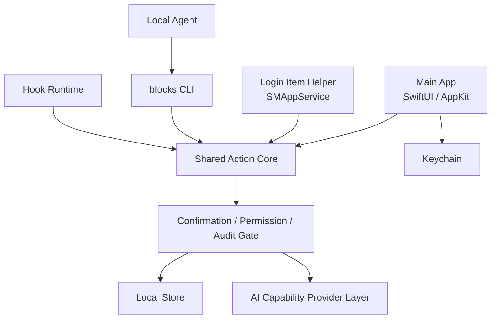

# 正式 App Scaffold 架构 v0

状态：proposed
最后审阅：2026-07-02
来源级别：architecture constraint

本文把 P2-K 后的技术验证结果收敛为正式 App scaffold 前的运行架构。它不是 Xcode 工程说明，不创建正式 App，也不代表三类工具 UI 已实现。

对应决策记录：[正式 App Scaffold 架构](../决策记录库/2026-07-02-正式AppScaffold架构.md)。
架构 spine：[P2-L App Scaffold Architecture Spine](../项目管理库/000_归档/2026-07-05_项目视图改造前/规划产物/architecture/p2-l-app-scaffold-architecture/ARCHITECTURE-SPINE.md)。

## 当前核验来源

- Apple App Sandbox：<https://developer.apple.com/documentation/security/app-sandbox>
- App Sandbox entitlement：<https://developer.apple.com/documentation/bundleresources/entitlements/com.apple.security.app-sandbox>
- Apple SMAppService：<https://developer.apple.com/documentation/servicemanagement/smappservice>
- Apple ScreenCaptureKit：<https://developer.apple.com/documentation/screencapturekit/>
- JSON Schema Draft 2020-12：<https://json-schema.org/draft/2020-12>
- JSON Schema Test Suite：<https://github.com/json-schema-org/JSON-Schema-Test-Suite>
- `swift-json-schema` 候选库：<https://github.com/ajevans99/swift-json-schema>

## 架构结论

正式 scaffold 暂定为：

```text
SwiftUI + AppKit + sandbox-first + SMAppService helper + shared action core
```

这是一条 P3 起步约束，不是最终分发渠道、商业化或完整工程依赖的冻结。



## 进程职责

| 模块 | 首轮职责 | 不做 |
| --- | --- | --- |
| Main App | 菜单栏、截图浮层、剪贴板面板、翻译面板、设置页、UI 本地化、平台材质、权限引导、快捷键配置、确认卡片、Keychain provider 配置、审计展示。 | 不长期轮询剪贴板；不静默外发；不直接运行任意 hook 脚本；不本地化 CLI/action 机器字段。 |
| Login Item/helper | 剪贴板 recorder、后台心跳、轻量事件采集、redacted event 上报。 | 不默认执行外部 CLI provider；不运行 hook；不在日志、IPC 摘要或 agent 默认结果中暴露真实内容；不自动粘贴。 |
| Shared Action Core | 截图、剪贴板、翻译 action 的 typed validation、权限检查、确认需求、统一 envelope、审计 ID。 | 不持有 UI 状态；不绕过确认；不把 P2 smoke 脚本带入 runtime。 |
| `blocks` CLI | agent 结构化调用入口，列出 action、输出 schema、执行 action、返回 JSON envelope。 | 不绕过 `requires_confirmation`；不读取 Keychain secret；不直接返回完整敏感历史。 |
| AI Capability Provider Layer | LLM provider、Translation Engine、OCR Engine 的 profile catalog、配置校验、外发预览和审计摘要；P5-I 已加入 LLM adapter protocol 和本地 mock adapter，P5-K 已加入 API key 输入预览、用户 Keychain 保存门禁和 OpenAI connection dry-run，P5-L 已加入低敏 OpenAI-compatible test connection，P5-N 已将 Translation UI 主路径接到 Translation Engine router，P5-O 已加入 OpenAI-compatible 翻译 runtime gate。 | P3/P5-O scaffold 只允许低敏 test connection、route/error 检查和用户开启 gate 后的翻译正文外发；不把截图、剪贴板历史完整内容或 OCR 图片交给真实 provider；用户 secret 只保存到 Keychain；不记录完整 provider 原始输出。 |
| Hook Runtime | 接收 hook 草稿、校验 manifest、展示启用影响和审计计划。 | P3 scaffold 不启用任意脚本；agent 生成 hook 默认仍是 draft。 |

## UI 本地化与平台材质

- V1 App UI 首批支持 `zh-Hans`、`en`、`ja`，默认跟随 macOS 系统语言。
- 主 App 拥有 String Catalog 或等价本地化资源，覆盖菜单栏、设置页、权限提示、截图选区状态、截图结果浮层和用户可读错误信息。
- 设置页包含 Language 区块：Follow System、简体中文、English、日本語。P3-A 可先保存偏好并提示重启生效，后续如需运行时即时切换再单独设计。
- 产品显示名已冻结为：简体中文「积木工具」，英文和日文「Blocks for Mac」；工程技术名 `Blocks`、CLI `blocks` 和机器字段不随显示名变化。
- `blocks` CLI、action namespace、JSON 字段名、schema、`error.code`、audit_id、短哈希和机器错误码不做本地化，避免 agent 与 hook 解释不一致。
- 视觉材质采用渐进增强：macOS 26+ 使用系统 Liquid Glass / `glassEffect`；macOS 14-25 使用 `.regularMaterial`、`.ultraThinMaterial` 或窄范围 `NSVisualEffectView` 回退。
- Liquid Glass 通过统一 wrapper / container 集中使用在截图结果浮层、确认卡片、设置页重点面板；截图拖拽 overlay 不使用重毛玻璃，以保证被截图内容可识别。

## 数据与安全边界

| 数据 | Owner | 存储规则 | 确认规则 |
| --- | --- | --- | --- |
| 截图图片 | Main App / action core | 用户确认保存后进入 App 数据或用户选择目录；临时文件不得进仓库。 | 截图后 AI/OCR/翻译前至少 `preview`，外部 provider 为 `external_transfer`。 |
| 剪贴板事件 | Helper 采集，Main App 管理 | 非排除 App 的支持类型默认保存本地可恢复表示；redacted index 用于列表摘要、agent 默认结果和审计。排除 App 只记录 skipped 状态、来源候选和时间。 | agent 读取完整内容必须 `preview`；外发必须 `external_transfer`。 |
| 翻译文本 | Main App / action core | 历史只保存用户允许的原文/译文和审计摘要；Translation Engine 可走 LLM-backed 或专用翻译 API。 | 非 mock engine 必须 `external_transfer`。 |
| OCR 图片/文本 | Main App / action core | Apple Vision OCR 可本地处理；multimodal LLM OCR / 云 OCR 外发前只保存摘要和审计，不保存完整图片到日志。 | 图片或截图进入外部 OCR / LLM 前必须 `external_transfer`。 |
| API secret | Main App / Keychain | Keychain 保存 secret；普通配置只保存 provider、model、base URL、Keychain account alias。 | agent 不得读取或迁移 secret。 |
| Hook manifest | Main App / local store | draft / enabled / disabled 状态可存储；enabled 需要审计。 | 启用、阻断、修改、删除、自动外发必须 `destructive_or_hook`。 |
| Audit log | Action core 生成，Main App 展示 | 保存 audit_id、action、时间、provider、确认级别、redacted preview。 | 不保存完整 secret、完整截图 base64、完整剪贴板历史或 provider 原始敏感输出。 |

## Step 5 Clipboard / helper 清理注记

- Step 5 已删除 P4 helper/debug 路径：无 `BlocksLoginItemHelper` target、无 Embed LoginItems、无 helper entitlements、无 `ClipboardRecorderRuntimeService`，也无 App 内 recorder preflight/watch/session/reset UI。
- Clipboard 默认读取模型改为 metadata-first / redacted-first。默认 repository load、list/card/tray、Settings、DataAudit 和 CLI 默认输出不得读取完整 payload。
- 完整 payload 读取只允许在显式 purpose 下发生：paste、copy plain text、hover detail、translation preview。payload cache 按 `(recordID, purpose)` 分区，reload 时清理。
- P4 脚本已退役为 Step 5 cleanup guard；当前阻断门禁为 P8/P9/P11E/P12。
- future helper、App Group、CLI clipboard payload、开机常驻 recorder 或共享容器能力必须另开 PRD，不得从历史 P4 兼容分支恢复。

## P5-H / P5-I / P5-J / P5-K / P5-L / P5-M / P5-N / P5-O Provider 实现注记

- P5-H 将 provider 目录拆为 LLM Provider、Translation Engine 和 OCR Engine 三个能力域；翻译和 OCR 可以复用 LLM，也可以接专用 engine。
- P5-I 新增 `LLMProviderAdapter`、`LLMProviderRequest`、`LLMProviderResponse`、`LLMProviderError`、`OpenAICompatibleProfileBoundary` 和 `LLMProviderMockAdapter`。
- OpenAI-compatible boundary 只保存 base URL host 摘要、model、Keychain account alias、provider id/name 和 timeout，不保存 API key、完整 prompt、messages 或 provider 原始输出。
- Settings 中的 LLM Adapter Boundary 只能生成 `external_transfer` 预览或本地 mock audit event；不会调用网络、执行 CLI、读取 Keychain、读取剪贴板或运行 OCR。
- P5-J 的 API Key Input Gate 使用 `SecureField` 接收候选 key 并支持字符数/account alias 预览；P5-K 在用户勾选确认后可写入 `openai-compatible:<alias>` Keychain item，并立即清空候选值。
- P5-K 的 OpenAI Connection Preview 只生成 `POST /v1/chat/completions` dry-run 元数据；不会读取 Keychain secret 或发送网络请求。
- P5-L 的 Test Connection Gate 会在用户显式确认后短生命周期读取 `openai-compatible:<alias>` secret，并发送固定低敏 ping test；自动化验证使用 mock transport，不调用真实外部 provider。
- P5-M 的 Provider Routing Foundation 已新增统一 route / error / localization 边界，Translation 面板和 Settings 可做本地 route check；不读取 secret、不联网、不执行 CLI。
- P5-N 的 Translation Engine Router Integration 已把 Translation 面板 picker 迁到 `TranslationEngineProfile`；Local Mock 继续生成本地 mock result，LLM-backed Translation 和 Dedicated Translation API 只展示 route/error 和 confirmation level。
- P5-O 的 Translation Runtime Gate 已新增 `OpenAITranslationRuntimeService`；用户开启 Settings gate 且 Keychain/base URL/model/alias 齐备时，LLM-backed Translation 可调用 OpenAI-compatible `/v1/chat/completions`。自动化验证仍用 mock transport，不调用真实外部 provider。
- P5-O 不代表 OCR、总结、截图/OCR 图片外发、剪贴板历史完整内容外发、streaming、重试、模型列表或持久 provider audit 已开放。
- 未来真实 provider 接入必须基于 P5-M/P5-N 路由和错误边界继续补具体 runtime、必要的内容外发确认和脱敏审计。

## Action 与 Schema

- `docs/技术知识库/action-schemas/` 继续是接口事实源。
- 第一方 action 使用 Swift typed model / `Codable` / 显式业务校验，不依赖 `Codable` 自动覆盖未知字段、跨字段确认或脱敏 preview。
- CLI 外部输入、agent 外部输入和 hook manifest 进入 enabled 或执行路径前，必须通过完整 JSON Schema validator adapter 或等价严格校验。
- P2-K 的 `swift-json-schema` `0.13.1` 结果只证明候选可行；P3 scaffold 可以预留 adapter，但不得把该库写成正式采用，除非另有依赖决策。

## 首个 Scaffold 非目标

- 不接真实支付、订阅、license server 或云账号。
- 不调用真实 API provider、真实 OCR provider 或真实 CLI provider，不读取环境变量中的真实 key。
- 不启用任意 hook 脚本，不做自动阻断、修改、删除或自动外发。
- 不实现完整三工具 UI；P3 仍按截图纵切优先推进。
- 不把 `tools/spikes/` 代码直接搬成正式工程。
- 不证明多屏、权限撤销、第三方复杂剪贴板样本、长期 helper 功耗或 App Store 审核可行。

## P3 进入门槛

进入 P3-A 前至少要有：

1. 一个最小 formal scaffold 计划，说明目录、target、entitlement、helper 嵌入方式和测试命令。
2. 截图纵切的 action / UI / permission / audit 端到端路径。
3. 对 P2 未覆盖项的复测列表，不把环境依赖项阻塞到 scaffold 起步。
4. 安全检查：没有 secret、证书、真实截图、真实剪贴板内容或 provider 原始输出进入仓库。
