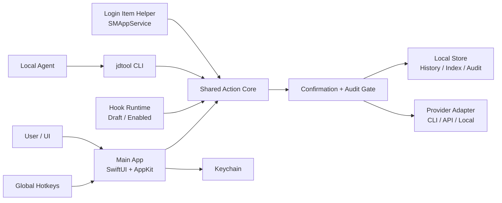

# P2-L App Scaffold Architecture Spine

状态：final
updated：2026-07-02
来源级别：fast-path architecture spine

## Scope

本 spine 固定正式 App scaffold 前的架构不变量。它不是完整工程设计，也不创建 Xcode/App 工程；P3 仍需要单独的 scaffold 或截图纵切计划。

## Inherited Invariants

- [ADOPTED] 正式 App 按 sandbox-first 设计，Direct Download 和 App Store 双出口暂不锁死。
- [ADOPTED] `jdtool.*` action schema 是 UI、CLI、agent 和 hook 的接口事实源。
- [ADOPTED] 截图、剪贴板、翻译内容进入外部 provider 或 hook enabled path 前必须可预览、可取消、可审计。
- [ADOPTED] P2-K 第一轮验证不能被解释为多屏、权限撤销、第三方复杂剪贴板样本、长期 helper 功耗或真实 API provider 已完成。

## Paradigm

**Sandbox-first local action runtime.**

主 App 是用户可见的授权和确认层；helper 是受限后台事件采集层；CLI / agent / hook 只能通过共享 action core 进入能力边界。任何敏感读取、外发、阻断、修改或自动执行，都必须经过统一 confirmation / audit gate。

## Architecture Decisions

### AD-1 Formal Scaffold Shape

Binds：P3 前正式工程的初始运行形态。

Prevents：各纵切独立选择不同 UI/runtime/权限模型。

Rule：[ASSUMPTION] 正式 scaffold 暂定为 `SwiftUI + AppKit + sandbox-first + SMAppService helper + shared action core`。该组合用于 P3 起步，不代表最终分发渠道或完整商业模式已定。

### AD-2 Main App Authority

Binds：所有用户可见授权、设置和确认路径。

Prevents：后台 helper、CLI 或 agent 绕过用户界面读取/外发敏感数据。

Rule：主 App 拥有菜单栏、浮层、设置页、权限引导、快捷键配置、confirmation cards、Keychain 配置、provider 设置、审计展示和数据清理入口。

### AD-3 Helper Boundary

Binds：Login Item/helper 的首轮职责。

Prevents：helper 变成隐形自动化执行器。

Rule：helper 优先承载剪贴板 recorder、后台心跳、轻量事件采集和后续最小状态同步。helper 默认不执行外部 CLI provider、不运行 hook 脚本、不做自动粘贴、不上传内容。

### AD-4 Shared Action Core

Binds：UI、CLI、agent、hook 的能力入口。

Prevents：截图、剪贴板、翻译形成多套业务逻辑和错误结构。

Rule：截图、剪贴板、翻译的正式实现必须经由 shared action core 暴露能力。CLI 使用 `jdtool` 前缀和统一 JSON envelope；需要确认时返回或触发 `requires_confirmation`，不得静默执行敏感路径。

### AD-5 Confirmation And Audit Gate

Binds：敏感读取、外发和 hook 生效路径。

Prevents：provider、agent 或 hook 直接消费完整截图/剪贴板/选中文本。

Rule：`preview`、`external_transfer`、`destructive_or_hook` 三级确认继续作为正式 runtime 的安全分界。确认 preview 默认只放摘要、数量、来源、provider、条目 ID 和短哈希；完整敏感内容只在用户明确授权的 UI 中显示。

### AD-6 Schema Validation Boundary

Binds：schema 文件和 Swift runtime 的关系。

Prevents：把 P2 Python 子集校验器或候选第三方库误当正式 runtime。

Rule：JSON Schema 文件继续作为接口事实源。第一方 action 优先用 Swift typed model / `Codable` / 显式业务校验；CLI 外部输入、agent 外部输入和 hook manifest 在进入 enabled 或执行路径前，必须通过完整 validator adapter 或等价严格校验。[ASSUMPTION] `swift-json-schema` `0.13.1` 只是候选，不是正式依赖。

### AD-7 Local Data Ownership

Binds：历史、索引、配置、secret 和审计记录的归属。

Prevents：真实敏感内容散落在 helper、CLI 输出、日志或普通配置文件。

Rule：本地 store 保存历史索引、用户配置、审计摘要和低敏 metadata；Keychain 保存 API secret；普通配置最多保存 provider 名称、模型名、base URL 和 Keychain account alias。真实剪贴板内容、截图文件和 provider 原始输出不得进入可提交仓库或普通日志。

### AD-8 Distribution Envelope

Binds：正式 scaffold 的分发假设。

Prevents：为了单一路线过早牺牲 App Store 或直接下载候选能力。

Rule：Local Dev 使用 local signing；Alpha 前再准备 Developer ID、Hardened Runtime、notarization 和更新路径；App Store / StoreKit 仍是候选路线，不进入 P3 scaffold 的真实支付实现。

## Runtime Responsibility Matrix

| 能力 | Main App | Helper | CLI / agent | Provider / hook |
| --- | --- | --- | --- | --- |
| 截图触发与结果浮层 | owns | none | can request action | provider only after confirmation |
| 剪贴板 recorder | controls settings and review | collects redacted events | query through action | hook draft only |
| 翻译 | owns source preview and result UI | none by default | can submit structured request | external transfer confirmation required |
| Keychain | owns account UI and secret lifecycle | no direct ownership in P3 | no secret read | no direct secret persistence |
| Hook | reviews draft and enables | no execution by default | may generate draft | enabled path requires destructive_or_hook |
| Audit | displays and clears | emits redacted events | receives audit_id | records provider/hook summary |

## Deferred

- Multi-display and cross-display region behavior beyond the current single-display machine.
- Permission denial, revocation and reauthorization flows for Screen Recording, Accessibility and Login Item user approval.
- Third-party complex pasteboard samples from password managers, browsers, Office and design tools.
- Long-running helper power, restart and crash recovery policy.
- Formal adoption or rejection of `swift-json-schema` after wrapper and cross-file `$ref` validation.
- Direct Download update path, Developer ID/notarization and App Store review viability.

## Next

P2-L unlocks a P3 planning step. The next plan should either create the minimal formal App scaffold, or define P3-A screenshot vertical slice on top of this spine.
