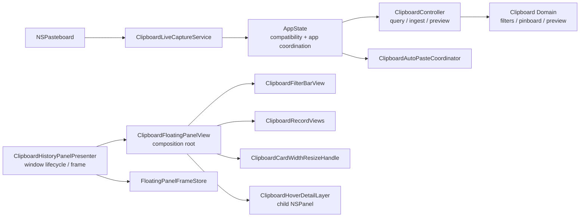

# P8-M Clipboard Modularization Architecture Spine

状态：final
updated：2026-07-04
来源级别：fast-path architecture spine

## Scope

本 spine 固定剪贴板模块化重构的不变量。它约束 P8-M 及后续剪贴板维护工作，目标是让 UI、AppKit 窗口交互、剪贴板领域模型、设置 key 和 app-level 协调不再互相混杂。

本 spine 不新增产品功能，不改变现有 UserDefaults key，不引入新的生产持久化语义。

## Inherited Invariants

- [ADOPTED] `docs/产品知识库/工具/文本/剪贴板历史-当前产品与实现逻辑.md` 是 P8-M 的不回归基线。
- [ADOPTED] bottom 面板底边固定 `visibleFrame.minY`，宽度固定为 `visibleFrame.width`，只允许高度变化，范围 `260...430`，只保存 height。
- [ADOPTED] 条目宽度全体统一，范围 `180...520`，key 为 `clipboard.panel.bottom.cardWidth`。
- [ADOPTED] 真实复制内容进入当前内存态历史，文本 / URL / 文件路径直显，图片显示缩略图。
- [ADOPTED] 详情使用单 child `NSPanel`，显示在条目上方，可进入，不被父面板裁剪。
- [ADOPTED] 筛选组点击展开，hover 只负责展开后离开收起；再次点击已选项取消筛选。
- [ADOPTED] 单击 / 双击粘贴模式持久化，key 为 `clipboard.panel.pasteActivationMode`，bottom 和 side 行为一致。

## Paradigm

**Local-first modular clipboard controller.**

剪贴板模块保留本地内存态产品语义，由 `ClipboardController` 承接剪贴板专属查询和变更规则；`AppState` 保留兼容转发和跨模块协调；SwiftUI panel view 只做装配；AppKit coordinator 和窗口 presenter 各自拥有单一交互边界。

## Architecture Decisions

### AD-1 AppState Compatibility Boundary

Binds：剪贴板状态和 app-level 协调的分工。

Prevents：把所有剪贴板领域逻辑继续塞进跨业务 `AppState`。

Rule：`AppState` 可以持有当前剪贴板 published 状态和对外方法名，保证调用面不一次性破坏；查询、preview、source options、live ingest、pinboard name 等剪贴板专属规则必须委托给 `ClipboardController` 或后续剪贴板 store。

### AD-2 Panel View Composition Root

Binds：`ClipboardFloatingPanelView` 的职责。

Prevents：大 SwiftUI 文件重新承载 AppKit tracking、filter domain、card/detail 组件和 settings key 定义。

Rule：`ClipboardFloatingPanelView` 只负责 header/search/tray/list 的装配、selection、当前展开 filter group、hover record id 和粘贴触发组合。卡片、行、筛选组、宽度 resize、详情 panel、settings key 不在该文件定义。

### AD-3 Presenter Owns Window, Not Paste Execution

Binds：`ClipboardHistoryPanelPresenter` 与自动粘贴的边界。

Prevents：窗口 resize / dismiss 修复误伤自动粘贴，或自动粘贴错误类型污染窗口 presenter。

Rule：Presenter 只拥有 panel lifecycle、frame、top-edge resize、focus、target app capture 和 dismiss island。`ClipboardAutoPasteCoordinator` 独立拥有 payload 写回、Accessibility 检查、目标 app 激活和 `Command + V` 事件。

### AD-4 One Hover Detail Runtime

Binds：条目详情实现路径。

Prevents：同时存在父 panel 内 SwiftUI overlay、popover、child panel 多套详情状态机。

Rule：详情只允许单 child `NSPanel` + panel-level mouse tracking + screen bridge。详情定位使用 screen rect 跟随条目并 clamp 到可见屏幕；不得回退到父面板内部 overlay 裁剪或延迟隐藏 task。

### AD-5 Domain Files Match Product Concepts

Binds：筛选、Pinboard、preview、本地化的文件边界。

Prevents：`ClipboardRecorder+Localization.swift` 再次成为产品域模型杂物箱。

Rule：筛选模型在 `ClipboardFilters.swift`；Pinboard 在 `ClipboardPinboard.swift`；preview 在 `ClipboardRecordPreview.swift`；`ClipboardRecorder+Localization.swift` 只保留 item kind 本地化展示。

### AD-6 Typed Clipboard Settings

Binds：UserDefaults key、默认值和 clamp。

Prevents：设置 key 分散在 view、settings、AppState，导致迁移和门禁漏改。

Rule：剪贴板设置 key 和底部卡片布局常量集中到 typed settings 支持层。已有 key 保持兼容；本轮不做 key rename 或 migration。

### AD-7 Verification Follows Module Boundaries

Binds：静态门禁和重构后的文件结构。

Prevents：门禁继续盯旧单文件导致假失败，或只搜字符串导致旧逻辑回流。

Rule：P7/P8 门禁允许符号迁移到新模块，但必须反向断言：大视图不得定义 AppKit coordinator / filter group / card / detail；presenter 不得定义 auto-paste coordinator；本地化文件不得定义筛选、Pinboard 或 preview。

## Deferred

- 生产级 `ClipboardRepository`，包括 records/payloads 持久化、裁剪、迁移和重启恢复。
- 保存前完整 `ClipboardCapturePolicy`，包括排除 App、drop/redact/accept 三态策略。
- 完整 Pinboard 编辑器、颜色、排序和持久化。
- Paste Stack、富文本编辑和 side 模式大视觉重构。
- 自动化实物 UI harness：真实鼠标、截图、筛选、宽度拖动、面板 resize、hover detail、自动粘贴。

## Next

P8-M story 必须基于本 spine 执行模块拆分、门禁更新、自动验证和 acceptance record。后续新增剪贴板功能必须先检查是否会改变上述不变量；若会改变，需要单独 story 或架构修正流程。
