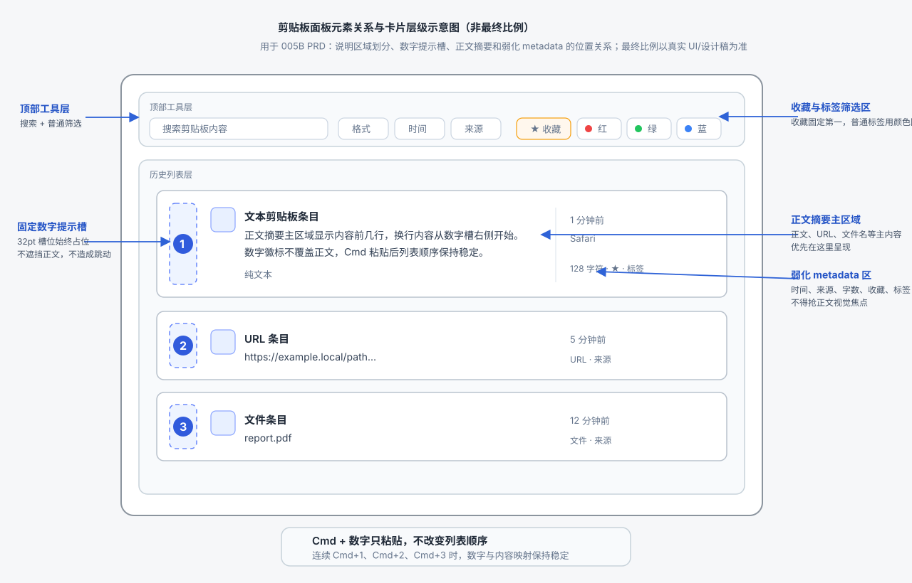
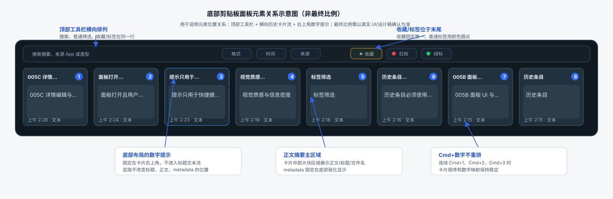

# 005B 面板 UI 与交互 PRD

状态：confirmation-ready-awaiting-user
日期：2026-07-08
负责人：项目负责人
来源级别：PRD draft

## 1. 目标

重新定义剪贴板面板的条目展示、筛选、收藏、右键菜单、设置页标签管理和视觉层级，让界面优先呈现稳定专业感，同时保留多彩类型识别和足够信息密度。

本 PRD 涉及 UI 代码改动，必须经用户确认后才能实施。

## 2. 范围

- 底部剪贴板面板的历史卡片。
- 新旧历史条目的展示一致性。
- 选中、hover、键盘焦点状态。
- 搜索、普通筛选、标签筛选、收藏筛选。
- 右键菜单层级。
- `Cmd+1` 到 `Cmd+9` 快捷粘贴的数字提示。
- 卡片边距、正文区域、类型色、标签和状态展示。
- 设置页 > 剪贴板 > 标签管理的标签列表、新建标签区域和动作按钮。

## 3. 卡片展示规则

### 3.0 标题与内容分区

- 卡片标题区域默认显示用户友好的本地化类型，不显示正文、URL host、文件名或字符数。
- 如果用户为条目设置了自定义标题，标题区域显示自定义标题；自定义标题对所有历史条目开放，长标题单行省略。
- 类型标题范围：文本、富文本、链接、文件、图片、混合内容、未知内容，需中英日三语同步。
- 主内容区域负责展示正文/URL/文件名/图片缩略图等对象内容；标题区域不得承担正文摘要职责。
- 底部 metadata 默认只保留左下时间。`Cmd` 数字提示在右下独立槽位；收藏星标在右上动作/状态槽位。三者不得互相挤占。
- 卡片背景和内容区域应视觉上是一体，不再使用额外内嵌正文框、内嵌分割容器或明显的“卡片套卡片”结构。
- 隐私排除、payload 不可读、旧条目缺 payload 等状态默认不在卡片主视觉中显示；详情卡可展示完整状态说明。若卡片完全无可预览内容，可使用弱占位，但不得把字符数作为主内容。

### 3.1 混合智能摘要

历史条目必须使用同一套混合智能摘要规则：

- 文本和富文本：主内容区域显示正文摘要，支持多行预览。
- URL：主内容区域默认显示 URL 字符串的可读摘要；当记录中已存在本地捕获的页面标题、来源标题或来源 App 元数据时，主内容可显示该标题，URL 摘要降级到底部 metadata 或次级信息。不得为了生成 URL 摘要调用外部网络、provider 或远端解析。
- file URL：主内容区域默认显示文件名；只有文件名不可解析或缺失时，才显示路径摘要。完整路径属于长字段，只能在详情或显式展开中展示，不得挤压主内容。
- 图片：当图片 payload 可读且隐私策略允许时，主内容区域显示缩略图；当缩略图不可生成、payload 不可读或策略不允许预览时，显示类型化图片摘要。OCR 状态只作为弱化状态，不得替代缩略图或图片摘要成为主内容。
- mixed/unknown：显示类型化摘要和可恢复状态。
- payload 不可读或内容不可预览：显示“内容不可预览”类状态，不把字符数作为主内容。

字符数、字节数、修订号等技术信息只能放在底部 metadata 或详情中，不得占据卡片主内容区域。

### 3.2 历史条目一致性

- 新复制条目和旧历史条目必须走同一展示规则。
- 如果旧条目缺少完整 payload，仍应展示合理的类型化摘要或不可预览状态。
- 不允许同屏出现“新条目显示正文、旧条目主区域只显示字符数”的不一致结果。

### 3.3 视觉层级

- 保留多彩类型识别，但类型色应服务识别，不抢正文。
- 当前选中：使用最明确的边框或背景层级。
- hover：轻量底色、边框或阴影，不应与选中态混淆。
- 键盘焦点：使用细焦点环或等价提示，不与选中/hover 抢主状态。
- 收藏星标、标签、OCR、隐私排除等状态应弱化，不能压过正文摘要。
- `Cmd+数字` 数字提示和收藏星标语义不同：数字提示是按住 `Cmd` 时才出现的临时快捷键识别；收藏星标是持久状态和可执行动作。两者不得共用同一槽位、同一强调色或相似到难以区分的徽标样式。

### 3.4 快捷数字提示

- 面板打开且用户按住 `Cmd` 时，当前面板实际展示顺序中的前 9 条历史应显示 `1` 到 `9` 的数字提示。
- 如果搜索、筛选、标签或收藏过滤已生效，数字提示按过滤后的当前可见列表重新编号；面板关闭时不显示提示，但快捷键按全局最近历史前 9 条生效。
- 数字提示不得作为标题字符串前缀，也不得插入标题文本流；它必须是独立的快捷键提示控件。
- 左右或纵向列表布局使用固定左侧快捷键槽：槽宽 32pt，位于卡片内容左内边距之后、正文摘要之前；数字徽标尺寸 22pt x 22pt，圆角 6pt，居中显示。
- 底部横向面板因为单卡宽度较窄，不使用标题前置槽；数字徽标固定悬浮在卡片右上角，尺寸 22pt x 22pt，距卡片上边和右边各 10pt。标题文本起点保持现有左内边距不变，标题行右侧永久预留徽标安全区，避免数字出现/消失时标题重排、截断策略变化或横向跳动。
- 数字字体使用 12pt semibold tabular number；背景使用系统 accent 色或等价高对比强调色，文字使用反色；不可粘贴条目使用灰色描边徽标，不使用填充强调色。
- 快捷键槽独立于正文、类型图标、收藏星标、标签和 OCR 状态；数字提示不得覆盖正文摘要、类型识别色、收藏星标或主要状态。
- 当条目同时处于收藏状态且位于快捷粘贴前 9 条时，必须同时可识别数字提示和收藏状态：数字提示使用快捷键槽；收藏星标使用状态/动作槽或底部 metadata 状态区。底部横向面板中，数字徽标占用右上角快捷键槽时，收藏星标不得再占同一右上角位置。
- 数字提示只在按住 `Cmd` 时出现，松开后消失；隐藏时使用透明占位、visibility 切换或等价方式，不得通过移除布局节点导致标题、正文、metadata、卡片宽高或滚动位置跳动。
- 当前列表不足 9 条时，只显示已有条目的数字。

左右或纵向列表布局图：

底部横向面板布局图：

示意图说明：

- 上述 SVG 是元素关系和区域划分示意，不是最终视觉比例稿，不作为最终卡片宽高、面板高度、字体大小、边距和色值的唯一依据。
- 最终 UI 比例必须基于真实剪贴板面板截图、现有设计 token 或实现中的组件尺寸确认；UI 相关实现开始前，需要用真实比例截图或更高保真设计稿补充确认。
- `[1]` 到 `[9]` 是按住 `Cmd` 时出现的数字徽标。
- `star 收藏` 固定在标签筛选组第一位；普通标签只显示颜色圆点和标签名。
- 数字徽标不覆盖正文，不改变卡片高度或正文起点；在底部横向布局中也不改变标题起点。
- 搜索或筛选生效时，数字徽标对应当前可见列表的前 9 条。
- `Cmd+数字` 粘贴后，列表顺序保持不变，因此数字与内容的对应关系稳定。
- 左右或纵向列表布局使用左侧固定数字提示槽；底部横向面板使用右上角固定悬浮数字徽标，避免窄卡片标题和正文被左侧槽位挤压。

## 4. 筛选与标签管理规则

### 4.1 普通筛选

- 格式、时间、来源保留现有筛选组形态。
- 普通筛选可继续通过 hover 展开，但必须扩大安全区和延迟，避免鼠标稍微离开即收起。
- hover 展开/收起需要真实鼠标路径录屏验收。

### 4.2 收藏与标签筛选

- 收藏筛选和标签筛选放在同一个平铺筛选区域，该区域位于筛选区最后。
- 收藏筛选固定为该区域第一个 chip，使用独立星星图标，不暴露底层标签模型。
- 普通标签 chip 位于收藏之后，图标统一使用标签颜色圆点，不使用星星、标签形状等额外符号。
- 标签筛选默认平铺展示，不需要点击展开。
- 用户直接点击收藏或标签 chip 即可筛选；再次点击同一 chip 取消筛选。
- 收藏选中态和普通标签选中态应可区分，但不能让收藏看起来像普通标签。
- 标签数量过多时，应提供可预测的横向滚动或折叠策略，但不能把标签重新塞回普通 hover 组作为默认路径。

### 4.3 设置页标签管理

适用于 [006-设置标签管理问题.png](assets/006-设置标签管理问题.png) 中的设置页剪贴板标签管理区域。

- 标签列表行的主识别区域必须采用“图标/色块 + 标签名”的顺序：收藏使用星标，普通标签使用对应颜色圆点或色块；图标/色块紧贴标签名前方，并与标签名共同形成一组稳定标题。
- 普通标签的颜色标识不应放在标签名之后、动作按钮附近或难以判断归属的位置。
- 设置页标签展示口径必须和剪贴板面板标签筛选口径一致：收藏是独立星标入口，普通标签是颜色标识；不得暴露收藏底层可能复用标签模型的实现事实。
- 标签管理动作按钮保留现有功能范围，不在 005 中新增批量管理能力；但按钮需要统一尺寸、高度、圆角、间距、hover、focus、disabled 和 pressed 状态。
- 动作按钮应使用语义清楚的图标按钮或图标+短文本按钮；仅图标按钮必须有 tooltip 和可访问性标签。多个按钮不得挤成一团，也不得出现两个语义相近但外观几乎相同的按钮。
- 破坏性动作，例如删除，应与普通编辑/排序/合并等动作有明确视觉区分，但不能用过强样式抢占整行主视觉。
- 新建标签输入框和创建按钮需要形成一组稳定控件：高度、对齐、边距和焦点态一致；创建按钮不应像临时拼接的小控件。
- 标签行在 hover、选中、键盘焦点或按钮显隐时，标签名、色块、描述和动作按钮区域不得发生明显跳动。

## 5. 右键菜单规则

菜单层级从上到下：

1. 粘贴。
2. 复制纯文本。
3. 收藏 / 取消收藏。
4. 编辑详情。
5. 标签子菜单。
6. OCR 重试等条件性动作。
7. 删除。

要求：

- 收藏必须是一级动作，位于标签子菜单上方。
- 标签子菜单只承载普通标签管理，不承载收藏主入口。
- 右键菜单不得出现 `Edit details`、`clipboard.filter.tags` 或其他未本地化内部 key。

## 6. 视觉质感与信息密度

- 优先稳定专业感：层级清楚、状态不跳、主操作可预测。
- 其次视觉质感：类型色、玻璃层、边框和阴影统一。
- 最后信息密度：可适度压缩上下边距，但不得牺牲正文可读性和点击安全区。
- 核心内容区域应比当前截图更稳定、更大，尤其不能被标题、底部 metadata 和状态徽标挤压。

## 7. 验收标准

- 新旧历史条目卡片展示一致。
- 字符数、字节数不占据主内容区域。
- 多彩类型识别保留，但视觉噪声降低。
- 单击选中态、hover 态、键盘焦点态可区分。
- 按住 `Cmd` 时前 9 条数字提示清晰、稳定、不遮挡主内容；数字提示出现/消失不引发布局跳动。底部横向布局验收时必须对比 `Cmd` 按下前后标题起点、正文起点、metadata 位置和卡片尺寸均不变化。
- 收藏条目在按住 `Cmd` 显示数字提示时，数字提示和收藏星标同时可识别，且不重叠、不共用同一右上角槽位、不导致布局跳动。
- 收藏与标签筛选默认平铺，位于筛选区域最后；收藏固定第一且使用星星图标，普通标签只使用颜色圆点，直接点击生效。
- 收藏入口在右键一级菜单，位于标签上方。
- 设置页标签管理中，收藏或普通标签的图标/色块展示在标签名前方；标签管理按钮视觉统一、语义清楚、状态完整，不再呈现为杂乱的小按钮组。
- 普通筛选 hover 扩大安全区，真实鼠标路径不容易误收起。
- 无内部 key 或英文硬编码外露。

## 8. 验收证据

- 对照 `assets/001-内容展示问题.png` 的新旧条目截图。
- 对照 `assets/002-筛选收藏右键问题.png` 的筛选和右键菜单截图。
- 对照 `assets/006-设置标签管理问题.png` 的设置页标签管理截图，证明图标/色块位于标签名前方，按钮组视觉统一且状态清楚。
- 普通筛选 hover 展开/移动/收起录屏。
- 收藏和标签筛选同组平铺、收藏固定第一、普通标签只用颜色圆点，以及点击生效的截图或录屏。
- 按住 `Cmd` 显示前 9 条数字提示的截图，以及 `Cmd+数字` 粘贴对应条目的录屏；证据必须证明快捷粘贴后列表顺序不变，并覆盖收藏条目同时显示数字提示时不与星标冲突。
- 选中、hover、键盘焦点状态截图。

## 9. 代码扫描确认的实施范围

本节只定义实施范围，当前 PRD 确认前不进入 UI 代码修改。

### 9.1 预览和标题模型

- `ClipboardRecordPreview.swift`
  - 当前问题：`defaultPreviewTitle` 对文本使用 summary，对 URL 使用 host，对 file URL 使用文件名；这与“默认标题为类型，自定义标题才覆盖”不一致。
  - 实施范围：改为统一标题策略：record 级自定义标题优先，否则本地化类型。正文、URL、文件名和图片缩略图只进入 body/thumbnail。

- `ClipboardSearchDocumentBuilder.swift` / `ClipboardRepository+SearchDocuments.swift`
  - 当前问题：`preview_title` 和 `preview_body` 持久化旧语义，旧历史会继续沿用正文/host/文件名标题和字符数 body。
  - 实施范围：更新 search preview 构建规则，并通过一次性重建或迁移让旧历史 preview 也归一到新规则；不保留旧 preview 兼容分支。

- `ClipboardStore.swift`
  - 当前问题：优先使用 repository preview snapshot；如果 snapshot 旧语义未重建，UI 改了也会显示旧标题。
  - 实施范围：确保 Store 默认路径只消费新语义 preview；fallback 也必须符合新标题/body 规则。

### 9.2 卡片和列表布局

- `ClipboardRecordViews.swift`
  - 当前问题：底部卡片使用内嵌 `ClipboardDirectContentPreview` 背景，标题行同时放标题、收藏星标、排除状态，底部混放时间、badge、tags、OCR。
  - 实施范围：底部卡片改为一体化内容面；标题左侧固定不因数字提示改变；右上为收藏动作/状态槽；右下为 `Cmd` 数字提示槽；底部只保留左下时间。

- `ClipboardFloatingPanelView.swift`
  - 当前问题：仍有 `pasteActivationModeControl` 和 `@AppStorage(clipboard.panel.pasteActivationMode)`，保留旧单击/双击切换。
  - 实施范围：移除 UI 开关和运行时分支，单击固定 selectOnly，双击固定 paste；旧设置只能一次性退出，不作为运行时分支。

### 9.3 筛选和标签

- `ClipboardFilterBarView.swift` / `ClipboardFilters.swift`
  - 当前问题：标签是 `ClipboardFilterGroup.tag` 的普通展开筛选，和格式/时间/来源同层。
  - 实施范围：格式、时间、来源保留普通筛选；收藏+标签拆成独立平铺区域并放在最后。收藏固定第一个星标 chip，普通标签只用颜色圆点。

- `ClipboardTagStore.swift` / `ClipboardTag.swift`
  - 当前事实：收藏底层仍可复用内置 favorite tag；UI 不得暴露该实现事实。
  - 实施范围：数据模型可保持 favorite tag，但筛选、右键和设置页文案必须把收藏表现为独立入口。

### 9.4 右键菜单和设置标签管理

- `ClipboardRecordViews.swift`
  - 当前问题：收藏位于 `ClipboardTagMenu` 子菜单中；存在硬编码 `Edit details` 和默认快速标签名 `New Tag`。
  - 实施范围：收藏/取消收藏上移为右键一级动作，位于标签子菜单上方；所有菜单项本地化；标签子菜单只处理普通标签。

- `ClipboardSettingsPane.swift`
  - 当前问题：标签名称在行标题，星标/色块在右侧 action 区，按钮组尺寸和层级杂乱。
  - 实施范围：标签行左侧主标题改为“星标/色块 + 标签名”，描述跟随主标题；右侧动作按钮统一尺寸、间距、hover/focus/disabled/pressed 状态和 tooltip。

### 9.5 不进入 005B 的事项

- 不实现 `Cmd+数字` 写剪贴板和排序例外，那属于 005A；005B 只负责数字提示的 UI 槽位和稳定性。
- 不实现详情保存逻辑和 metadata 读模型，那属于 005C。
- 不以 SVG 示意图作为最终比例稿；最终 UI 比例必须基于真实面板截图或实现尺寸验收。
