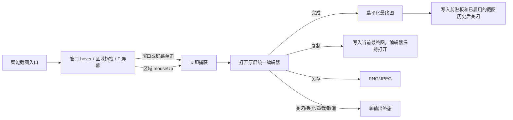

# PRD：截图采集与基础编辑

状态：confirmed-unified-editor-in-validation
最后审阅：2026-07-19
负责人：项目负责人
来源级别：phase PRD confirmation draft

## 1. 背景

现有截图功能分别提供区域、窗口和单屏全屏入口。区域在鼠标松开后立即完成，不能二次调整或跨屏；结果使用固定预览窗，没有非破坏编辑、自动复制和统一 GUI/CLI 捕获契约。

第一阶段将三个独立入口收敛为智能选择层，并建立“捕获原图 -> 原屏统一编辑 -> 用户显式复制/完成/保存”的基础闭环。捕获瞬间不得改写剪贴板。

## 2. 目标

- 通过一个入口完成窗口、区域、单屏和全部屏幕捕获。
- 在多显示器、混合缩放和负坐标环境中得到正确像素结果。
- 建立非破坏截图文档、共享渲染器和完整基础标注工具。
- 截图后进入单一原屏编辑器，需要更多工具时展开同一工具条和属性行。
- GUI、CLI 和 Action 共用捕获、渲染和导出核心。
- 建立可复用的 App 级设计 token，但第一阶段只在截图及直接复用组件落地。

## 3. 非目标

- 不做持久截图历史、OCR、OCR 搜索或 AI 图片外发。
- 不展示 OCR、翻译和总结 route-ready 入口；这些入口在 Phase 5 再恢复。
- 不做滚动长截图、高级背景美化、自动上传或云分享。
- 不做 GIF、视频或音频录制。
- 不长期保存可继续编辑的图层工程文件。
- 不在本阶段主动重做现有设置页或剪贴板面板。

## 4. 核心流程

## 5. 智能选择层

### 5.1 入口

- 截图设置工作台、菜单栏和默认快捷键只提供“智能截图”。
- 不展示或注册区域、窗口和屏幕的独立 GUI/快捷键入口。
- CLI 仍允许显式指定区域、窗口和屏幕，用于无编辑捕获和自动化。

### 5.2 自动裁决

- 指针命中可捕获窗口时，显示最终捕获边界和窗口名称；单击立即捕获。
- 任意位置形成有效拖拽后，区域模式接管；拖拽期间 hover 不再改写用户意图。
- 鼠标松开后应用比例、固定尺寸、吸附和最小尺寸约束并立即捕获，不进入调整态。
- `Space` 锁定窗口选择；`Tab/Shift+Tab` 在重叠窗口、父窗口和子对象间循环；`F` 进入单屏模式，`Shift+F` 直接捕获全部屏幕。
- 底部快捷提示条在选择期间全程紧凑展示；区域手势开始后只保留当前可用操作。
- 窗口识别失败时保持区域待命并给出轻提示，不静默截取整屏。

### 5.3 窗口层级

- Sheet、Popover、菜单和子窗口可作为独立候选。
- 当前高亮边界就是最终捕获内容，不做隐式合并。
- `Tab/Shift+Tab` 可切换到所属主窗口或其他重叠候选。
- 工具自身窗口、工具条、放大镜和辅助 UI 不进入候选列表，也不出现在最终图中。

### 5.4 区域约束

- 显示虚拟桌面坐标和最终输出像素尺寸。
- 支持放大镜、显示器/窗口/明显 UI 边缘吸附。
- 支持自由比例、16:9、4:3、1:1，以及 800x600、1920x1080 固定输出像素。
- 最小选区为 16x16 输出像素。
- 拖动过程中实时显示约束后的最终矩形；不保留确认按钮、双击确认或松手后调整路径。

### 5.5 屏幕与冻结

- 按 `F` 后 hover 高亮某块显示器，单击立即捕获该屏幕。
- `Shift+F` 立即捕获全部屏幕并按物理布局合成一张图。
- 冻结画面是工具条可选开关，默认关闭并记忆最近值。
- 冻结时像素画面和窗口候选必须来自同一快照，避免高亮与最终内容不一致。

### 5.6 临时参数

- 工具条以明确字段呈现 `尺寸：内容`、`延迟：值`、`冻结：开关`、`水印：值`，长截图保持独立入口；四个参数字段的标签列和值列分别等宽，值槽固定为 96×28pt。延迟和水印不显示下拉箭头但仍通过值槽打开原生菜单；切换长短值不得改变工具条尺寸。窗口截图始终严格使用窗口本身边界，不提供阴影外扩。
- 工具条默认位于鼠标所在屏幕顶部居中，只能通过专用把手拖动；位置只在当前会话有效。
- 工具条参数即时同步到设置，即使本次截图取消也保留最后一次选择。
- 每种参数分别记忆最近值；设置页提供默认值。
- 默认值：延迟 0 秒、实时画面、自由比例、PNG。

## 6. 多显示器和像素规则

- 使用虚拟桌面坐标处理左右、上下和负坐标显示器。
- 跨屏区域按每块显示器求交、分别捕获并合成。
- 混合缩放时按最高 backing scale 建立画布，低密度切片按物理位置缩放。
- 全部屏幕保留相对物理布局；显示器间空洞使用透明像素，JPEG 导出时转白色。
- 跨屏或全部屏幕存在任一切片失败时整体失败，不输出缺块图片。

## 7. 编辑文档和工具

### 7.1 文档模型

- `ScreenshotSceneDocument` 保存冻结源上下文、当前 `ScreenshotSceneSnapshot`、revision、撤销/重做栈和交互 draft。
- 缩放、平移、hover 和工具选择只改变编辑器状态，不写入输出 recipe。
- Core Graphics/Core Image 共享渲染器是预览、复制和导出的唯一输出语义。
- 指针按下后开启交互事务；拖动每一帧更新 `draftSnapshot` 并即时呈现，松手只提交一次撤销记录，取消则丢弃 draft。
- 对象移动、矩形对象缩放、线段端点和裁剪范围均使用控制柄/命中测试驱动同一事务，禁止拖动每帧写入撤销栈。
- 完成后只输出最终扁平图；重新编辑从该扁平图开始。

### 7.2 工具清单和默认顺序

1. 选择
2. 比例（默认快捷工具）
3. 线条/箭头
4. 矩形
5. 椭圆
6. 自由画笔
7. 文字
8. 高亮
9. 模糊
10. 像素化
11. 计数器
12. 步骤
13. 标注气泡
14. 聚光
15. 隐私遮盖
16. 放大镜

- 首次安装全部工具可见。
- 选择与关闭同属固定命令组，不能隐藏或拖动；编辑器不再提供“移动工具栏”控件。
- 尺寸是圈选范围上方状态条中的固定命令，不进入工具配置。其余工具可在快捷、更多、隐藏三区自由调整，三区均不限制数量；水印在 v18 默认配置中位于更多区。
- 快捷区、更多区和隐藏区共用一份顺序；分区归属和顺序通过一次原子移动共同更新并持久化，工具样式全局共享。
- 每个工具分别记忆颜色、线宽、填充、字体、透明度和强度。
- 完成一次标注后保持当前工具；`V` 返回选择。`Esc` 按“输入法组合 → 文字编辑 → 退出编辑器”分层处理。
- 新文档始终从选择工具开始，不继承上次激活工具。

### 7.3 固定文档命令

- 撤销、重做、复制、另存、重截和完成固定在顶部命令区。
- 固定文档命令不参与显隐或排序。
- 无可用操作时保留位置并禁用，不能隐藏造成布局跳动。

## 8. 单一原屏编辑器

### 8.1 唯一编辑表面

- 交互截图只使用覆盖冻结源范围的单一 `ScreenshotEditorHostPanel`，画布、范围、对象、选择和撤销栈始终不变。
- 冻结源上下文是交互编辑的必需条件；构建失败时终止且不写剪贴板，并提供重新截图/取消。
- 不再创建独立完整编辑窗口，不恢复窗口尺寸，也不通过工具状态改变 panel frame、level、阴影或裁剪边界。

### 8.2 稳定工具条与扩展工具

- 主工具行固定提供关闭、选择；随后是按配置解析的快捷工具、更多、撤销/重做和输出组。编辑器工具栏不可拖动。
- 第二行属性栏常驻并保持稳定高度；没有有效属性时显示轻量占位。复制、保存、重截和完成固定在同一输出组。
- 选择固定显示；比例和其他可配置工具严格按快捷、更多、隐藏的持久化归属呈现。快捷段超出可用宽度时在自身范围内横向滚动，并提供边缘渐隐和可点击、可键盘访问的滚动按钮；“更多工具”只显示明确配置到更多区的工具。面板按工具数量使用一至三列并完整容纳中英日工具名；主栏不得使用无提示滚动、临时改写归属、丢失或重排持久化配置。
- 设置使用一份 `toolOrder`、`quickToolIDs` 和 `hiddenToolIDs`；不对快捷数量做截断，更多工具由其余可见工具推导。

### 8.3 对象优先编辑与专业工具

- 创建工具和临时对象选择独立。创建工具保持 armed，但点击已有对象优先选中和编辑；点击空白继续使用原工具。
- Option 拖动强制创建新对象；Command 单击循环重叠对象；OCR 为独占状态。尺寸是状态条固定命令，不进入可持续创建的裁剪工具模式。
- 计数器、标注气泡、聚光、隐私遮盖和放大镜使用按类型约束的 preset 与 appearance。标注气泡是“可选椭圆＋连接箭头＋文字”的单一复合对象：单击创建指向点位的箭头和文字，拖动则用椭圆圈选目标后连接文字。目标和文字可独立移动/缩放，连接线两端保持绑定，箭头本体只调整曲率。
- 编辑对象后的属性同时成为该工具下次默认；正文与计数器当前编号不保存为默认值。

### 8.4 文字输入

- 单击画布创建自动尺寸文本框，随内容增长到最大宽度后换行；拖拽创建固定宽度文本框，高度随内容增长。
- 输入、draft 和最终输出共用 `ScreenshotTextLayout + CoreText` 的字体、字重、颜色、行高、换行和 padding。
- 输入框正文、输入法 marked text、typing attributes、插入光标和最终渲染必须使用同一 sRGB 前景色，元素透明度只允许合成一次。
- 字号或样式变化必须重新测量并保持左上锚点；手动调整宽度后转为固定宽度。空文字提交删除对象，`Esc` 取消输入。
- 旧 `ScreenshotEditorMode`、双 surface、旧显隐字段、`ScreenshotEditCommand` 和 `ScreenshotEditorLayout` 属于 breaking replacement 禁止项。

### 8.5 比例、颜色、数值与步骤

- 捕获与编辑共用 `orientation + constraint` 比例模型；横向/竖向可切换，竖向自动交换非正方形比例和固定尺寸，自由模式解除约束，自定义比例保存宽高与方向。
- 编辑器不暴露裁剪工具。点击圈选范围上方状态条的“尺寸”打开 420pt 紧凑 Popover；捕获参数条与编辑器状态条共用方向、草稿、校验、保存和应用模型。方向双选项等宽、图标容器固定，自定义输入和“应用/保存并应用”保持同一行。
- 颜色由 `ScreenshotResolvedColor` 统一解析为 sRGB；输入法 marked text、输入态、draft、缓存和最终渲染只合成一次透明度。属性色块为 20pt，面板提供基础色、最近色、十六进制和系统自由选色。
- 所有连续数值属性使用“滑杆 + 可编辑数值框”；回车或失焦提交，Esc 恢复，越界截断，方向键按最小步长调整。
- 步骤工具由序号、连接线和说明文字三个子目标组成，`Tab` / `Shift-Tab` 循环切换，并分别复用计数器、线条/箭头和文字属性。序号和文字独立移动/缩放，连接线只调整曲率，两个逻辑端点分别绑定对应模块。默认间距为 28pt（最小 8pt），序号直径支持 18–160pt。空说明在编辑器中保留命中区并显示“请输入文字”，但占位不进入导出；空步骤最终只输出序号。
- 放大镜采用单一原位镜片：创建位置就是取样中心与最终镜片位置，不生成第二个圆、独立源点或隐藏偏移。单击创建默认 120pt 镜片，拖拽创建 60–240pt 正圆；移动、等比缩放和 1.5×–5× 倍率调整均实时预览，取样范围在画布边缘平移而不裁小拉伸，预览与最终导出共用同一几何和图层顺序。
- 工具在有效画布内使用专属光标，离开画布、进入工具条或关闭编辑器时恢复系统箭头；工具提示在 hover 后立即显示且不改变布局。

## 9. 统一设计语言

- 建立 App 级设计 token；截图先使用，设置页和剪贴板不在本阶段主动迁移。
- 字体：苹方 title 20 semibold、body 13 regular、control 12 medium、meta 10–11 medium；数字使用等宽数字。
- 间距：4/8/12/16/28pt；圆角：badge 6、compact 8、surface 10、card 14、panel 18/20。
- 截图橙只表示模块身份；交互和焦点使用系统 accent。
- 成功使用系统绿，警告使用系统橙，错误和危险操作使用系统红。
- 界面和画布完全跟随系统明暗外观；棋盘格、图片边框和阴影确保内容在两种外观下可辨。
- 单层玻璃只用于工具条、导航和瞬时功能层；画布和设置内容层不嵌套玻璃卡片。
- 图标优先使用统一线重的 SF Symbols，并提供 tooltip 和 VoiceOver 名称。

## 10. 设置和入口

- 左侧点击“截图”直接进入单页紧凑设置工作台，顶部展示“开始截图”；不保留截图首页或中间设置 route。
- 工作台按捕获、编辑器和输出三组编排；快捷键只在统一快捷键页面管理。
- 捕获分组直接复用正式截图工具条。新增“固定捕获设置”，默认开启：开启时会话修改只影响本次，关闭时沿用截图工具条最后一次修改值。
- 编辑器分组展示主工具条预览；点击预览进入内容驱动高度的设置 Sheet，不再提供初始紧凑/展开状态。设置页不展示运行态状态条。
- 设置预览按真实运行结构显示“关闭/选择”固定命令组、快捷工具和“更多工具”入口；配置弹层将快捷、更多和隐藏三区分别显示为单行横向 Strip，超宽后提供触控板滚动。
- 三个 Strip 的工具块、间隙、首尾和空分区均可接收拖放；跨区移动以一个原子操作同时更新归属和顺序，只持久化一次。工具配置不限制三区数量，并提供 2pt 插入线、键盘/VoiceOver 替代操作和恢复默认。
- 设置变更即时保存；捕获、编辑器、输出分别提供局部恢复默认，工具弹层可独立恢复顺序和显隐。
- 截图工具栏、编辑器、设置和工具配置中的按钮使用至少 36×36pt 完整矩形命中区，图标视觉尺寸保持紧凑。

### 10.1 Quiet Pro、曲率锚点与丢弃确认

- 选择工具条高 48pt；编辑工具条主行 48pt、属性行 38pt。属性行隐藏系统滚动条，溢出时保留触控板横向滚动，并显示边缘渐隐与可点击、可键盘操作的左右按钮。两条工具栏使用单层玻璃、14pt 外圆角、10pt 工具岛、36×36pt 命中区和统一的 default/hover/pressed/selected/focus/disabled 状态。
- 线条/箭头使用同一工具和属性模型；首尾端点均为“无”时就是直线，不再提供独立直线入口。曲率属性和画布控制点共用同一吸附状态模型：属性阈值为进入 0.06、解除 0.09；画布按屏幕距离进入 8pt、解除 12pt。Option 绕过吸附，双击归零，一次拖动只提交一次撤销和一次 preset 持久化。
- 脏截图关闭确认提供系统“不再提示”复选框。只有勾选后选择丢弃才关闭后续确认；完成或取消不改变偏好。设置页提供“丢弃编辑前确认”，默认开启；`Esc` 继续直接取消编辑。
- 截图偏好当前版本为 v19：v18→v19 把旧文字/签名/图片多实例水印收敛为单一平铺文字水印，保留可迁移的文字预设 ID、名称、文字、颜色、字重和透明度，删除签名/图片资产与旧运行分支。捕获参数条的水印选择只覆盖本次截图，不改写设置默认。
- 多个聚光对象先合成一份取最大亮度的全局遮罩，再仅绘制一次暗色背景；重叠和羽化区域不得因对象数量累计变暗或变亮。

## 11. 输出和剪贴板

- 捕获成功和编辑器出现时不写剪贴板、不建截图历史。
- “完成”以最终扁平图写剪贴板一次，按当前设置写截图历史，然后关闭编辑器。
- 主工具条不再显示“复制”，原位置改为“钉住”：渲染最终图、关闭编辑器、不写剪贴板、按现有历史总开关归档，并在原截图所在显示器创建临时置顶钉图窗口。钉图 100% 按裁剪区域逻辑点尺寸定义，Retina 输出像素不得直接作为 AppKit 点尺寸；默认窗口覆盖原截图区域的屏幕相对位置，使截图与背景保持空间连续，只在超出当前显示器安全区时做最小位移，尺寸仍无法容纳时才初始适配。显式复制可从悬浮工具条或右键菜单执行，钉图不提供鼠标穿透。
- “保存”只写文件，不复制；长截图保存成功需要关闭时以不写剪贴板和历史的保存终态结束。
- 关闭、丢弃、重截和取消均不写剪贴板或截图历史；用户此前主动复制的内容不回退。
- PNG 默认并保留透明；JPEG 默认质量 90%，透明区域白底。
- 自身 pasteboard 写入必须被监听器抑制，避免被普通剪贴板采集重复入库；截图历史由 Step 2 的专用归档 sink 决定。

## 12. 快捷键、菜单和 CLI

- `screenshotRegion` 直接替换为唯一 `screenshotSmart`；旧自定义绑定不迁移，旧 key 和运行时 alias 一并删除。
- 菜单栏只展示智能截图，不保留三模式子项。
- `blocks run blocks.screenshot.capture --interactive` 未指定 mode 时默认 `smart`。
- `--interactive` 只接受缺省 mode 或 `smart`；`--no-editor` 必须显式指定 `region|window|display`，不允许 `smart`。
- `displayScope` 只用于 `display`，支持 current/all/display ID，缺省 current；未指定 `--output` 或 `--copy` 时默认复制。
- Action 输入使用 `kind = smart|region|window|display`、可选 `displayScope` 与 `watermark = default|none|preset UUID`；CLI 以 `--watermark` 暴露同一覆盖契约。输出只返回实际 `region|window|display`，永不返回 `smart`。
- 交互式 CLI 通过请求 ID 和本地 Action bridge 等待完成、取消或错误；CLI 不实现选区层和编辑器。

## 13. 架构边界

- 独立 `BlocksScreenshotCore` framework 承载 intent、坐标模型、选择 reducer、`ScreenshotSceneDocument`、scene snapshot、交互 draft、渲染和编码；禁止依赖 AppKit、SwiftUI、ScreenCaptureKit、UserDefaults 和 NSPasteboard。
- `ScreenshotCaptureIntent` 使用 `kind + displayScope`；`ScreenshotCaptureResult` 使用实际 kind、实际 display scope、像素尺寸、sRGB 和 capture ID。
- 统一选择协调器负责选区状态机和多屏 overlay；捕获服务只负责 ScreenCaptureKit 图像读取与合成。
- ScreenshotStore/FeatureCoordinator 继续承接权限检查、状态和用例编排，不将平台捕获逻辑放入 Store。
- 编辑器 presenter 只管理覆盖冻结源范围的单一 `ScreenshotEditorHostPanel`；Store 持有单个活动 `ScreenshotSceneDocument`。
- 通用 `BlocksActionBroker` 作为用户级 LaunchAgent，通过 XPC 路由 CLI/Action；只在 Agent 与 CLI 设置中显式启用，App 未运行时由 broker 启动并等待最多 8 秒。
- 第一阶段不修改剪贴板持久化 schema 或 Provider 授权模型。

## 14. 验收矩阵

| 范围 | 自动化 | 真实证据 |
| --- | --- | --- |
| 智能裁决 | 状态机、候选循环、拖拽接管、冻结、降级 fixture | 窗口/区域/屏幕完整录屏。 |
| 多屏捕获 | 虚拟桌面、切片和像素合成 fixture | 双/三屏、负坐标、1x/2x、跨屏和全部屏幕输出。 |
| 编辑工具 | scene document、draft 事务、控制柄、各工具像素、撤销重做测试 | 标注、文字、裁剪、对象控制柄和打码前后截图。 |
| 步骤与放大镜 | 子目标移动/缩放、连接线布局与像素、单镜片几何、边缘取样、图层顺序和倍率像素测试 | 序号/说明独立操作录屏；四色网格、文字和透明边界下的单镜片移动、缩放与倍率录屏。 |
| 统一编辑器设置 | 同一 Host、快捷/更多/隐藏三区配置和宽度解析 | 原屏编辑、三区往返、设置与运行态逐项同步录屏。 |
| 外观与访问性 | token、焦点、标签和多语言静态检查 | 浅色/深色、Reduce Transparency、键盘、VoiceOver。 |
| 剪贴板/导出 | 捕获/取消零写入、完成单次写入、显式复制、保存不复制、PNG/JPEG fixture | 剪贴板哨兵、Finder、Preview、浏览器和常见输入框读取。 |
| CLI/Action | schema、smart 默认、无编辑 mode、取消/错误码 | CLI 唤起 App 和无编辑捕获演示。 |

## 15. 当前确认门槛

用户已确认 A 方案统一编辑器并授权实现。当前代码包含单一原屏 Host、v16 快捷/更多/隐藏工具配置、文本自动/定宽尺寸和 CoreText 统一测量；旧双 surface、窗口双 frame 和阴影外扩路径已删除。自动化和构建结果见《开发与验收记录》；多屏、混合 DPI、完整 VoiceOver 和仍列为缺口的真实交互证据未闭合前，不得宣告 Step 1 全量完成。
