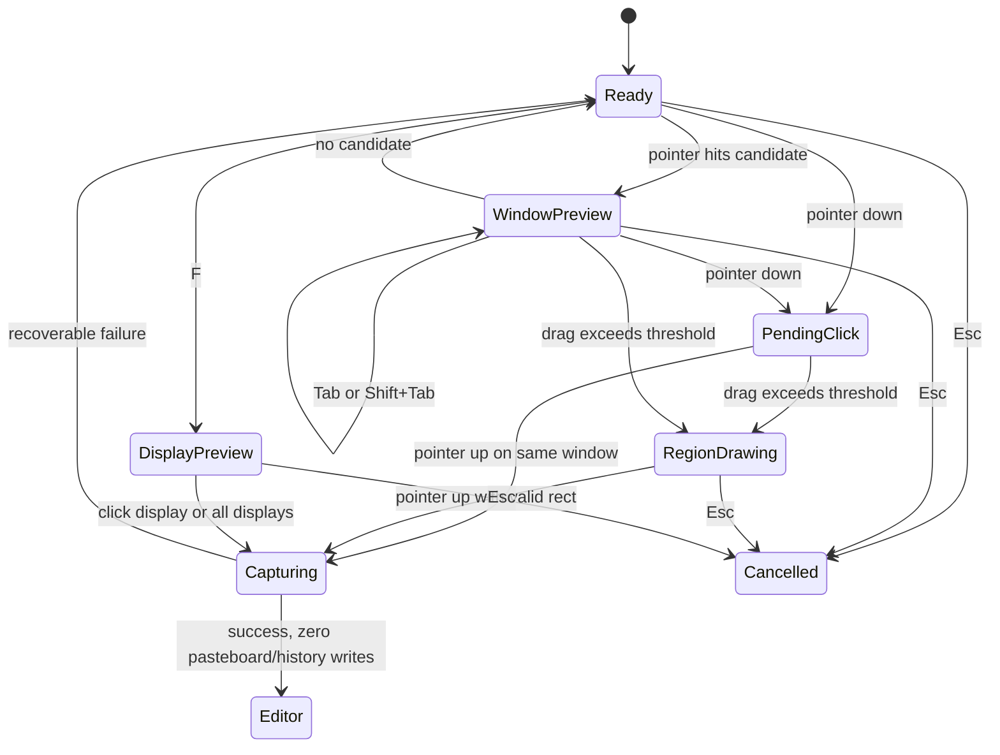

# UI/交互原型与状态说明

状态：confirmed-unified-editor-in-validation
最后审阅：2026-07-12
负责人：项目负责人
来源级别：confirmed UED draft

> 本文将已确认的截图交互和设计语言固化为开发输入。统一原屏编辑器已采用 breaking replacement，仍需完成运行时和真实 UI 验收。

## 1. 体验目标

- 一个入口覆盖窗口、区域、单屏和全部屏幕，避免用户在开始前选择模式。
- 窗口点击立即完成，区域第一次拖动即可框选并在松手后立即完成；专业效率和简单操作同时成立。
- 截图后始终在原屏统一编辑器内完成；需要更多工具时展开同一工具条，不创建第二个编辑窗口。
- 画布与截图内容优先，工具位置稳定，拖动时实时反馈且一次手势只形成一条撤销记录。
- 与现有设置页、剪贴板共享安静、专业、紧凑的基础语言，但不在 Phase 1 顺带重做现有页面。
- 界面遵守 macOS 焦点、键盘、VoiceOver、Reduce Transparency 和明暗外观行为。

## 2. 智能选择层

### 2.1 状态模型



### 2.2 默认命中与模式切换

- 进入后默认是 `Ready`，不预先声明区域、窗口或屏幕模式。
- 指针命中窗口候选时进入 `WindowPreview`，显示 2pt 系统 accent 边框和窗口名称；单击立即捕获。
- 任意位置拖动超过系统拖拽阈值后，区域意图锁定；窗口 hover 不再抢回状态。
- 区域 mouseUp 对比例、固定尺寸、吸附和最小尺寸做最终解析后立即捕获，不保留调整态。
- `Space` 锁定窗口选择；`Tab/Shift+Tab` 循环重叠及父子候选；`F` 进入单屏选择，`Shift+F` 直接捕获全部屏幕。
- Sheet、Popover、菜单和子窗口均可作为候选；高亮边界必须等于最终捕获边界。
- 无法识别窗口时保持区域待命并轻提示，不静默截取整屏。

### 2.3 选择层布局

```text
虚拟桌面遮罩
┌──────────────────────────────────────────────────────────────────────┐
│    [拖动柄] [尺寸：内容]  [延迟：下拉]  [冻结：开关]  [水印：下拉] │
│  未选区域：even-odd 外部遮罩                                          │
│                                                                      │
│       x 124  y 86 · 1280 x 720 px       ┌──────────┐                │
│       ■──────────────────────────────■   │ 96x96    │                │
│       │                              │   │ 放大镜   │                │
│       │          当前选区            │   └──────────┘                │
│       ■──────────────────────────────■                               │
│                                                                      │
│       Space 窗口 · Tab 切换候选 · F 屏幕 · 拖拽区域                  │
└──────────────────────────────────────────────────────────────────────┘
```

- 选择工具条高 48pt、外层圆角 14pt，默认位于鼠标所在屏幕顶部居中、距可见边缘 12pt；只能通过专用把手拖动，位置只在当前会话有效。
- 工具条按钮只修改参数，把手只移动工具条；区域手势开始后工具条降至约 28% 透明并忽略鼠标，不截断区域拖动。
- 坐标和尺寸使用 12pt medium 与等宽数字，位于选区左上外侧 8pt；空间不足时移入选区。
- 放大镜 96x96pt，距指针 18pt，显示中心十字、像素网格和颜色；靠近边缘自动翻转。
- 底部提示条在捕获期间保持紧凑可见；区域手势开始后简化窗口/屏幕无关提示。
- 工具自身窗口、工具条、放大镜和提示条均不进入候选，也不出现在结果中。

### 2.4 区域约束

- 支持自由比例、16:9、4:3、1:1，以及固定 800x600、1920x1080 输出像素。
- 支持显示器、窗口和明显 UI 边缘吸附；最小选区 16x16 输出像素。
- 约束在拖动过程中实时应用，显示矩形必须等于最终捕获矩形；没有确认按钮、双击确认或松手后调整路径。
- `Esc` 在选择和延迟倒计时阶段均取消截图。

### 2.5 屏幕、冻结与倒计时

- `F` 后逐块显示器 hover 高亮，单击该屏幕立即捕获。
- `Shift+F` 立即按物理布局捕获全部屏幕并合成一张图。
- 冻结是工具条开关，默认实时并记忆最近值；冻结后候选和像素画面必须来自同一快照。
- 窗口高亮、命中和最终输出统一使用窗口本身边界，不提供阴影外扩选项。
- 延迟倒计时使用屏幕中央轻量数字和进度，不使用遮挡画面的大卡片。

## 3. 统一设计语言

### 3.1 Token

| 类型 | 规范 |
| --- | --- |
| 字体 | 苹方：title 20 semibold、body 13 regular、control 12 medium、meta 10–11 medium；尺寸、坐标、缩放使用等宽数字。 |
| 间距 | 4 / 8 / 12 / 16 / 28pt。 |
| 圆角 | badge 6、compact control 8、surface 10、card 14、panel 18/20。 |
| 模块色 | 截图橙只表示截图模块身份，不承担选中、焦点或主操作。 |
| 交互色 | 选中、焦点、主操作使用系统 accent；成功绿、警告橙、错误和危险操作红。 |
| 图标 | 优先 SF Symbols，统一线重和固定命中区；无对应符号时才使用同规格自定义图标。 |
| 外观 | 所有界面和画布跟随系统明暗模式；Reduce Transparency 下以实色 surface 保证层级。 |

### 3.2 功能层玻璃

- 玻璃只用于工具条、导航和短时功能层，不作为页面背景或嵌套卡片装饰。
- 设置内容使用安静的分组 surface；画布使用中性内容层，不用玻璃包裹截图。
- 画布通过棋盘格、1px 图片边框和轻阴影区分透明内容与浅色截图。
- 同一视觉层级只保留一层材质，避免 glass-on-glass。
- Phase 1 建立 App 级 token，但只迁移截图页面及其直接复用组件。

## 4. 编辑器公共状态

- `ScreenshotEditorStore` 是一次编辑会话的唯一 App 状态所有者，持有唯一 `ScreenshotSceneDocument`、renderer、选择、viewport 和输出动作。
- `ScreenshotSceneDocument` 的 committed snapshot 与交互 draft 分离；按下开启事务，拖动实时更新 draft，松手提交一次，`Esc` 或工具切换前取消未提交事务。
- 编辑器只保留一个原屏 surface；关闭和选择固定显示，编辑器移动柄已删除且工具栏不可拖动。“尺寸”固定在圈选范围上方状态条中，其余工具按用户配置进入快捷、更多或隐藏分区；scene、选择、撤销/重做和画布状态不因工具呈现分区改变。
- 对象矩形显示八个控制柄，线段显示两个端点控制柄；范围工具命中边缘/角点后调整裁剪，命中内部后整体移动。
- 同时只维护一个活动文档；关闭、重截或开始新截图遇到脏文档时显示完成/丢弃/取消。用户勾选“不再提示”并实际丢弃后，后续直接丢弃；设置页可重新开启确认。`Esc` 始终直接取消编辑。

## 5. 原屏统一编辑器

统一编辑器要求具备冻结源上下文，服务截图后就地裁范围、常见标注和完整属性编辑。

```text
冻结源画面 / 原屏幕坐标
┌────────────────────────────────────────────────────────────────────────────┐
│                                                                            │
│          ┌────────────────当前输出范围────────────────┐                    │
│          │                                            │                    │
│          │               就地编辑内容                 │                    │
│          │                                            │                    │
│          └────────────────────────────────────────────┘                    │
│          [尺寸][圆角][当前范围内的对象结果……]                            │
│          [当前工具/对象有效属性................................]          │
│          [关闭][选择]│[快捷][更多]│[撤销/重做]│[输出组]                  │
└────────────────────────────────────────────────────────────────────────────┘
```

- 使用覆盖源屏幕范围的无标题、无阴影面板；界面外区域仍来自同一冻结 source context，不重新读取实时桌面。
- 状态条锚定实际圈选范围上方，属性行和主工具行组成的底栏锚定实际圈选范围下方；两者不能退化为屏幕顶边/底边布局。普通圈选保持完整画布；只有大图上下空间不足时才缩小展示画布以容纳两条 Chrome，输出像素不变。
- 状态条固定提供“尺寸”和“圆角”，随后逐个显示当前裁剪范围内的顶层对象；点击对象结果直接选中对应对象。设置页只预览主工具栏，不展示状态条。
- 关闭和选择固定提供；编辑器不再提供移动柄。其余工具可在快捷、更多、隐藏三区无限量配置。运行态严格保持用户分区：快捷段空间不足时只在自身横向滚动，并提供边缘渐隐和左右滚动按钮；“更多工具”只显示明确配置到更多区的工具，不压缩两侧命令区，也不临时改变任何工具归属。
- 范围变更实时显示纳入/排除内容，拖动过程只更新 draft，松手后才进入撤销栈。
- 属性栏常驻并保持稳定高度；没有有效属性时显示轻量占位，不移动画布、不切窗口、不触发像素渲染。
- 没有可扩展冻结源上下文时，本次截图终止且不写剪贴板，并提供重新截图/取消。

## 6. 工具条与属性状态

主工具栏与“更多工具”面板共同覆盖全部可见工具，不改变同一原屏编辑器和常驻属性栏。

```text
┌────────────────────────────────────────────────────────────────────────────┐
│ [关闭/选择][快捷区][更多][撤销/重做]│[钉住][保存][重截][完成]│
├────────────────────────────────────────────────────────────────────────────┤
│ [当前工具/对象有效属性.................................................] │
└────────────────────────────────────────────────────────────────────────────┘
```

- 不创建独立窗口或右侧检查器；属性只在稳定的 38pt 第二行横向呈现。系统滚动条始终隐藏；空间不足时保留触控板横向滚动，并显示边缘渐隐和可点击、可键盘访问的左右按钮，固定命令始终可见。
- 快捷区与更多区共用一份工具顺序；设置页通过分组表达归属，拖到工具库表示隐藏。
- `ScreenshotEditorToolbarLayout.resolve` 以可用宽度和真实控件宽度生成唯一布局结果；快捷段超宽时由带边缘提示的横向滚动承载，更多区不接收临时溢出项。禁止恢复 `ViewThatFits`、撑满剩余宽度、无指示滚动区或运行态归属重写。
- 从更多面板选中工具后立即关闭面板，更多按钮显示该工具图标和选中态，属性栏切换为对应属性；`Esc` 关闭并把键盘焦点交还触发入口。

## 7. 工具配置与行为

默认顺序：选择、线条/箭头、矩形、椭圆、画笔、文字、高亮、模糊、像素化、计数器、步骤、标注气泡、聚光、隐私遮盖、放大镜、水印。

- 选择与关闭同属固定命令组且不可隐藏；尺寸是状态条固定命令，不进入工具配置；其余工具支持显隐和拖动排序。
- 快捷、更多和隐藏三区均不限制数量；隐藏区不进入运行态，快捷区超宽时自身横向滚动，更多面板只显示明确归属到更多区的工具。
- 快捷区、更多区和隐藏区共用一份主顺序和逐工具样式，不维护两套显隐或排序模型。
- 设置预览只展示关闭、选择、快捷区和明确的“更多工具”入口，不展示运行态状态条或编辑器移动柄；配置弹层把快捷、更多和隐藏区分别呈现为单行横向 Strip。超宽后支持触控板滚动，不以自动换行改变工具相对位置。
- 三个 Strip 使用同一套 AppKit 指针拖动协调器；工具块、间隙、首尾和空分区都可接收投放，2pt 插入光标与横向自动滚动保持一致。跨区移动以单次原子更新同时改变归属和顺序；Space/Return、方向键、右键菜单和 VoiceOver 动作保留等价替代路径。
- 每个工具分别记忆颜色、线宽、填充、字体、透明度和强度。
- 完成一次标注后保持当前工具。点击已有对象优先进入对象编辑，点击空白继续使用当前创建工具；Option 强制创建，Command 单击循环重叠对象。
- 点击状态条“尺寸”打开 420pt 紧凑 Popover；捕获参数条与状态条共用方向、预设、自定义、校验、保存和应用模型，不再在编辑器属性行重复放置比例工具。OCR 是独占状态，退出后恢复原创建工具。新截图始终从选择开始。
- 水印是可配置工具和捕获参数，只支持单一平铺文字背景。同一截图最多一个水印；再次应用预设会替换当前水印。文字、颜色、相对字号、密度、倾斜角度和透明度在下方 38pt 属性条原位编辑；水印不覆盖画布命中，只由工具按钮或顶部状态条选中。
- 捕获参数岛使用 `尺寸：内容`、`延迟：值`、`冻结：开关`、`水印：值` 四个具名字段；四项标签列和值列分别等宽，值槽统一为 96×28pt。字段内部 4pt、字段之间 12pt；延迟和水印不显示下拉箭头，但点击完整值槽仍打开原生菜单。固定槽位负责吸收中英日与长短值差异。
- 全部工具和输出命令使用统一 36x36pt 命中区；钉住、保存、重截和完成属于同一输出组。
- Phase 1 不展示 OCR、翻译、总结或其他 AI 工具入口。

## 8. 截图设置工作台

- 左侧点击“截图”直接进入单页紧凑工作台，不保留截图首页或中间设置 route。
- 顶部提供“开始截图”；页面按捕获、编辑器和输出三组编排，复用统一设置 section、row、divider 和右对齐控件。
- 快捷键只在统一快捷键页面管理，截图工作台不重复展示。
- 捕获分组直接展示与正式截图一致的工具条；把手只保留外观、不允许在设置页拖动。
- “固定捕获设置”默认开启；开启时每次从设置基线开始，关闭时正式截图工具条的最后修改值会成为下次基线。
- 编辑器主页展示当前完整工具条预览；点击后进入内容驱动高度的独立设置 Sheet。
- 工具管理在该 Sheet 中完成，快捷、更多、隐藏三区使用不限数量的横向 Strip，提供跨区原子移动、区内排序、完整分区拖放命中、插入线、键盘排序、实时预览和独立恢复默认。
- 捕获、编辑器、输出各自提供局部恢复默认，不提供会影响其他分组的全局恢复入口。
- 共享工具顺序、快捷归属和隐藏集合即时保存，并同步到活动编辑器。
- 是否沿用截图会话参数由“固定捕获设置”决定；工具条位置始终不持久化。
- 全部图标按钮以至少 36×36pt 的完整区域命中，hover、focus、selected 背景覆盖完整按钮范围。
- 设置页遵循现有安静分组语言，不使用装饰性卡片或大面积玻璃。

## 9. 输出、焦点与访问性

- 捕获成功后直接打开编辑器，不写剪贴板和历史；“完成”扁平化后写最终图一次、按现有历史总开关写历史并关闭。
- “钉住”不写剪贴板，归档后创建可移动、等比缩放、调节透明度和键盘微调的置顶窗口；鼠标悬浮显示底部工具条，右键保留复制、保存和 OCR 等价入口，不提供鼠标穿透。100% 对应截图区域的原始逻辑点尺寸，普通截图默认 100%，并覆盖原截图区域的屏幕相对位置；靠近菜单栏、Dock 或显示器边界时仅做保持完整可见所需的最小位移，尺寸仍超出安全区才按实际百分比适配。长截图以原圈选区域顶边作为空间锚点。“保存”只写文件。关闭、丢弃、重截和取消均不写剪贴板或历史。PNG 默认，JPEG 默认 90% 且透明区域白底。
- 工具按钮、属性控件、画布对象均提供键盘焦点、tooltip 和 VoiceOver 名称。
- 文字编辑时 `Return` 输入换行，`Cmd+Return` 完成本次文字编辑；全局捕获快捷键不得抢占输入。
- `Cmd+Z` / `Shift+Cmd+Z` 只操作编辑文档，不记录缩放、平移、hover 或工具选择。
- 浅色、深色、Reduce Transparency 和自定义系统 accent 下都必须保持层级与焦点可辨。

## 10. 当前文档门槛

- 单一原屏 Host、同一 Store/scene、主栏加更多工具、实时 draft 事务和快捷/更多/隐藏工具配置是唯一编辑器口径。
- 旧 `ScreenshotEditCommand`、`ScreenshotEditorLayout` 与 `professional/compact` 分支必须从生产实现和静态门禁删除，不提供兼容迁移。
- 当前工作树实现已满足 P14-C/P14-D 静态契约；旧双 surface 截图或录屏不能作为统一编辑器 PASS。
- 可见交互仍须验证原屏 Host、范围控制柄、工具宽度溢出、工具跨区拖动和文字所见即所得，不能只以静态门禁替代。

## 11. Quiet Pro 与精确编辑返修（2026-07-18）

- 选择工具条与编辑工具条共用 Quiet Pro token：单层 regular glass、14pt 外圆角、10pt 工具岛、1pt/10% 描边、16% 黑色阴影；按钮均为 36×36pt 命中区、16pt medium SF Symbol 和 8pt 圆角。
- 默认内容使用 secondary；hover 为 primary 8%，pressed 为 15%，selected 为 accent 18% 并带轻描边。完成按钮仍是同尺寸 `checkmark`，只保留稳定的轻 accent 强调；关闭按钮仅在 hover/pressed 时使用危险色。
- 编辑工具条主行固定 48pt，属性行固定 38pt；设置预览复用生产组件，不维护另一套状态或尺寸。
- 文字输入框、输入法组合文字、typing attributes、插入光标、画布 draft 和最终 CoreText 输出均使用 `ScreenshotTextLayout` 产生的同一 sRGB 前景色；元素透明度只合成一次。
- 线条/箭头只保留一个入口，首尾端点均选“无”即为直线。曲率在属性滑杆 `abs(curvature) <= 0.06` 时吸附为直线，超过 0.09 才解除；画布控制点采用 8pt/12pt 进入与解除阈值。进入锚点仅触发一次对齐反馈，Option 临时绕过，双击控制点或数值恢复直线。
- 脏文档确认的“不再提示”只在勾选后实际选择“丢弃”时生效；完成或取消不修改偏好。截图设置提供“丢弃编辑前确认”开关恢复提示。

## 12. 比例、颜色、数值与步骤交互（2026-07-18）

- 捕获工具条的 420pt Popover 与编辑器的 38pt 比例属性条共用 `ScreenshotAspectControlModel`。Popover 的横向/竖向双选项占满整行并使用相同 20×20pt 图标容器，切换不改变行高；自定义模式、宽高、“应用”和“保存并应用”保持同一行，下一行固定保留错误槽。
- 编辑器用下拉框承载自由、内置比例、固定尺寸和最多 8 个已保存项；按钮始终显示当前实际约束。添加自定义只在同一属性条原位展开，应用或保存后失焦并收起，Esc 保留草稿返回下拉入口。
- 每个工具在画布内使用与其语义一致的光标；离开画布或进入工具条立即恢复箭头。工具名使用无布局占位的即时 tooltip，按下或拖动后隐藏。
- 颜色按钮视觉色块为 20×20pt、命中区 28×28pt。Popover 依次展示 12 个基础色、最近 8 色、`#RRGGBB` 输入和系统自由颜色入口。
- 连续属性统一显示滑杆和数值框；百分比显示 0–100%，倍率显示 x，尺寸显示数值。Return/失焦提交、Esc 恢复、上下键按步长调整。
- 步骤工具单击创建序号并进入说明输入；序号、连接线和说明是同一复合对象的三个子目标，`Tab` / `Shift-Tab` 循环切换。拖动序号或文字只移动对应模块，另一模块不动，连线相应端跟随；拖动连线只改变曲率。默认间距 28pt（最小 8pt），序号直径 18–160pt。空说明在编辑器显示灰色“请输入文字”并保留命中区，该占位不进入导出，空步骤只输出序号。
- 标注气泡是“可选椭圆＋连接箭头＋文字”复合对象。单击只生成指向点位的箭头与文字，拖动则增加圈选椭圆；默认连线长度约 64pt，在 48–96pt 内随画布空间收敛。椭圆和文字独立移动/缩放，连线两端保持绑定，箭头本体只调整曲率；空气泡在最终输出中整体过滤。
- 多个聚光对象先合成一份全局取最亮遮罩，暗色背景只应用一次；重叠与羽化区域不因聚光数量累计改变亮度。
- 编辑器放大镜只显示一个原位圆形镜片：单击创建默认 120pt，拖拽按 60–240pt 创建正圆；镜片中心同时是取样中心。拖动镜片直接移动取样位置，四角等比缩放，倍率为 1.5×–5×；画布边缘平移完整取样框，不再显示或命中第二个圆、源点、连接线或隐藏偏移，预览与导出使用同一受约束几何。
- Esc 分层：存在输入法 marked text 时只取消组合；普通文字输入时取消本次文字编辑；其余状态一次退出截图编辑且不弹确认。
