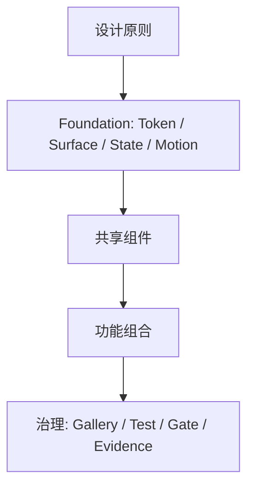

# 设计 Token 与组件规范

## 分层

- 原则层说明为什么。
- Foundation 层定义不可任意改变的语义空间。
- 组件层定义可复用的状态、几何和输入行为。
- 功能组合层只组合组件，不重新定义结构样式。

## Foundation Token

### 间距

| Token | pt | 用途 |
|---|---:|---|
| xxs | 2 | 极紧密文字关系、内部状态 |
| xs | 4 | 图标与文字、紧凑操作组 |
| sm | 8 | 标准组件内部间距 |
| md | 12 | 并列字段、面板内节奏 |
| lg | 16 | 分区内容间距 |
| xl | 24 | 主层级间距 |
| xxl | 32 | 页面级留白 |

### 圆角与密度

- 圆角：6 / 8 / 12 / 16 / pill。
- 密度：micro / compact / standard / content。
- 自定义紧凑控件可见高 28pt，标准控件 36pt，设置行最小 44pt。
- 实际命中区不得小于对应的密度契约。

### 布局与尾列

- 设置宽度按职责分为 `form` 820pt、`content` 1120pt、`sheet` 640pt；尾列在 220–360pt 内自适应，水平外边距由统一页面 Token 管理。
- 标准设置值控件与设置行的完整内容区域垂直居中；说明文字可在标题下方扩展，尾列仍保持统一右边缘。即使窗口缩到 820pt 最小宽度，也保持同一横向设置行。
- 设置行使用共享容器的中心对齐，不再维护标题首行 Alignment Guide，也不使用 `.top + Npt` 类型的经验补偿。

## Surface Role

| 层级 | 角色 | 规则 |
|---|---|---|
| 结构 | window / sidebar / content | 表达窗口和导航结构，不在内容中反复嵌套 |
| 内容 | section | 表达必要的分组，设置页不默认每节套玻璃 |
| 交互 | interactive | 选择、聚焦、按压等交互表面 |
| 浮层 | panel / popover / hud | 按任务层级使用原生 Material/Liquid Glass |

`settingsSection`、`floatingPanel` 及旧 Spacing／CornerRadius／Motion 别名已删除。源码只允许语义准确的单一 Token 和 Surface Role 路径。

## 共享组件

Phase 0 已建立以下基线：

- `BlocksActionButton`：标准文字操作，支持主、次、危险语义。
- `BlocksCompactIconButton` / `BlocksCompactActionGroup`：稠密 Chrome 的图标操作和稳定槽位。
- `BlocksToolbarContainer`：工具条间距、高度和表面的唯一入口。
- `BlocksPanelChrome`：面板标题与尾部操作的稳定布局。
- `BlocksStateView`：加载、空、说明、成功、警告、失败和恢复。
- `SettingsSectionHeader` / `SettingsSection`：分区标题和内容共用水平内缩。
- `SettingsFormRow` / `SettingsValueColumn`：值控件与整行垂直居中，所有可见控件共享尾边缘。
- `SettingsSegmentedRow`：互斥枚举设置的唯一分段行；控件容器统一贴齐尾列，分段内部文字保持系统原生居中。
- `SettingsBooleanSwitch` / `SettingsToggleRow`：持久二态设置的唯一 Switch 入口。
- `SettingsTextFieldRow` / `SettingsSliderRow` / `SettingsStatusRow`：表单输入、数值与稳定反馈的唯一行布局。
- `SettingsNavigationRow` / `SettingsActionRow` / `SettingsDangerRow`：导航、普通操作和危险操作的统一命中与层级。
- `SettingsSheetScaffold`：固定标题、可滚动内容和固定操作区的唯一 Sheet 壳层。
- 现有 Notification、Popover、Context Menu 继续复用全局入口。

## 组件完整性契约

每个共享组件都必须定义：

- idle / hover / pressed / focused / selected / disabled / loading / success / warning / error。
- 鼠标、键盘、VoiceOver 和至少 44pt 设置行命中契约。
- 浅色、深色、窗口失活、提高对比度和降低透明度。
- 减少动态效果降级。
- 中英日长文本和窄宽度。
- 动态状态改变时的几何不变式。

## Gallery

`BlocksDesignSystemGallery` 和 `SettingsDesignSystemGallery` 只在 Debug 构建中存在，不进入产品导航。前者覆盖全局 Token、Surface、交互和状态；后者真实渲染表单、Switch、Picker、文本框、Slider、状态、导航、操作、危险和空态行。
